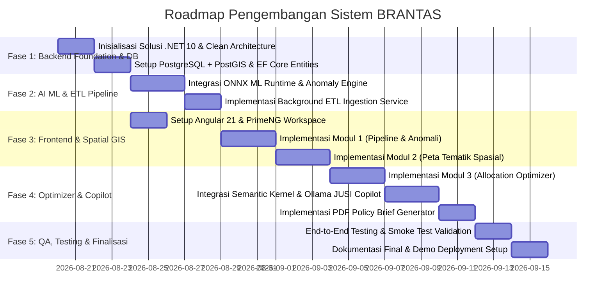

# DOKUMEN SPESIFIKASI TEKNIS & RANCANGAN PENGEMBANGAN SISTEM
# **BRANTAS (Basis Rekomendasi & Analisis Terpadu Anggaran Sosial)**
### Subtopik: Pengentasan Kemiskinan Berbasis Data (LAN Datathon 2026)

---

## 1. RINGKASAN EKSEKUTIF & LATAR BELAKANG SISTEM

### 1.1. Latar Belakang Masalah
Pemerintah Republik Indonesia mengalokasikan anggaran Perlindungan Sosial (Perlinsos) yang terus bertumbuh signifikan dalam Anggaran Pendapatan dan Belanja Negara (APBN):
- **2024:** Rp493,5 Triliun
- **2025:** Rp504,7 Triliun
- **2026:** Rp508,2 Triliun *(Sumber: Nota Keuangan RAPBN 2026 Kemenkeu RI)*

Selain anggaran belanja pemerintah pusat, alokasi Transfer ke Daerah (TKDD)—termasuk Dana Desa, Dana Alokasi Umum (DAU), dan Dana Bagi Hasil (DBH)—menempatkan indikator kemiskinan daerah sebagai salah satu variabel penimbang utama alokasi fiskal. Berdasarkan data Badan Pusat Statistik (BPS) per Maret 2026, persentase penduduk miskin nasional berada di angka **8,07% (22,93 juta jiwa)**, melandai dari posisi September 2025 (**8,25% / 23,36 juta jiwa**).

Meskipun tren kemiskinan menunjukkan perbaikan, eksekusi anggaran perlindungan sosial dan pengentasan kemiskinan masih menghadapi 3 masalah krusial di tingkat operasional dan kebijakan:
1. **Eror Inklusi dan Eksklusi (*Inclusion & Exclusion Errors*):**
   - *Exclusion error:* Masyarakat sangat miskin/rentan tidak terdaftar sebagai penerima bantuan sosial.
   - *Inclusion error:* Warga berkecukupan atau bahkan aparatur negara (ASN/TNI/Polri) terdata sebagai penerima. Temuan berulang LHP BPK RI atas LKPP mencatat adanya ketidakselarasan data bansos (DTKS/P3KE) dengan data kependudukan (NIK) dan status kepegawaian.
2. **Keterlambatan Pemutakhiran Data (*Data Lag & Static Allocation*):**
   - Pemutakhiran data kemiskinan bottom-up membutuhkan waktu berbulan-bulan. Alokasi dana bantuan sosial dan TKDD masih bergantung pada formula statis yang lambat merespons kejutan ekonomi lokal (*local economic shocks*) dan anomali bencana secara *real-time*.
3. **Ketiadaan Formulasi Rekomendasi Kebijakan Berbasis Kausalitas (*Causal Policy Void*):**
   - Analisis yang ada selama ini umumnya sebatas korelasi historis deskriptif tanpa inferensi kausalitas konkret (*Evidence-Based Policy Making - EBPM*). Studi *World Bank (Indonesia Economic Prospect)* menunjukkan bahwa efektivitas program perlindungan sosial dapat ditingkatkan **30% hingga 40%** jika integrasi data mikro kependudukan dan indikator spasial dimutakhirkan secara presisi.

### 1.2. Visi & 5 Pilar Solusi BRANTAS
Sistem **BRANTAS** dirancang sebagai platform terpadu *end-to-end* yang mengimplementasikan 5 Pilar Solusi:
1. **Pendataan (*Automated Multi-Source Data Pipeline*):** Mengonsolidasi data agregat publik dari BPS, DJPK Kemenkeu, P3KE Kemensos/Bappenas, dan Geoportal BIG ke dalam repositori terpadu secara otomatis.
2. **Validasi (*Cross-Dataset Anomaly & Consistency Checker*):** Menerapkan Machine Learning untuk mendeteksi *mismatch* alokasi anggaran vs indikator kemiskinan riil dan mengidentifikasi anomali inklusi/eksklusi.
3. **Pemetaan (*Spatial AI Choropleth Heatmap*):** Memetakan kantong kemiskinan, alokasi TKDD/Dana Desa, dan autokorelasi spasial hingga level Kabupaten/Kota dan Kecamatan.
4. **Prioritisasi (*Vulnerability Scoring & Allocation Optimizer*):** Menghitung skor kerentanan wilayah berbasis *Predictive AI* untuk merekomendasikan porsi alokasi dana secara objektif.
5. **Kebijakan & Monitoring (*Causal Policy Evaluator & Recommendation Engine*):** Mengukur *Causal Treatment Effect* intervensi anggaran serta menghasilkan *Policy Brief* dan asisten cerdas **JUSI (Juru Bantuan Sosial Interaktif)**.

---

## 2. ARSITEKTUR TINGKAT TINGGI & TEKNOLOGI STACK

Sistem BRANTAS dibangun menggunakan arsitektur enterprise modern dengan standar performa tinggi, modularitas, dan kedaulatan data (*Sovereign AI*).

```
+-----------------------------------------------------------------------------------+
|                            FRONTEND PRESENTATION LAYER                            |
|                 Angular 21 (Signals + Standalone) | PrimeNG UI                    |
|          Leaflet.js / Mapbox GL JS (Spatial GIS) | Apache ECharts                 |
+------------------------------------------+----------------------------------------+
                                           | HTTPS / REST API / SSE
+------------------------------------------v----------------------------------------+
|                      CORE API & ORCHESTRATION LAYER (.NET 10)                     |
|                               ASP.NET Core 10 Web API                             |
|    +-------------------------------------------------------------------------+    |
|    |                      Clean Architecture (CQRS / MediatR)                |    |
|    |  [Presentation] -> [Application] -> [Domain] <- [Infrastructure]        |    |
|    +-------------------------------------------------------------------------+    |
|    |  Native AI Inference Engine (Microsoft.ML.OnnxRuntime C# Native)        |    |
|    |  ETL Background Service (IHostedService / Channels)                     |    |
|    |  Sovereign GenAI Copilot (Microsoft Semantic Kernel .NET 10 SDK)        |    |
|    +-------------------------------------------------------------------------+    |
+---------------------+-------------------------------+-----------------------------+
                      |                               |
                      | Npgsql / EF Core              | HTTP Local IPC (Port 11434)
+---------------------v-------------+   +-------------v-----------------------------+
|        DATABASE & SPATIAL         |   |         SOVEREIGN LOCAL LLM ENGINE        |
|    PostgreSQL 17 + PostGIS        |   |                   Ollama                  |
| - Poligon Administrasi Wilayah    |   | - Meta Llama 3 8B / Qwen 2.5 7B           |
| - Data Kemiskinan & APBN/TKDD     |   | - Strict System Prompt Guardrails         |
| - Spatial Vector Tiles (ST_AsMVT) |   | - Gentle Refusal Out-of-Scope Engine      |
+-----------------------------------+   +-------------------------------------------+
```

### 2.1. Spesifikasi Komponen Teknologi

| Komponen | Teknologi Terpilih | Versi / Rincian | Justifikasi Teknis |
|---|---|---|---|
| **Frontend Framework** | Angular | 21 (Standalone Components) | Performa tinggi dengan Fine-grained Signals Reactivity, SSR-ready, dan Native Federation. |
| **UI Component Library** | PrimeNG | 19+ / PrimeFlex | Komponen enterprise lengkap (DataTable, Dropdown, Dialog, MultiSelect, Toast). |
| **Peta Spasial GIS** | Leaflet.js / Mapbox GL JS | Latest | Rendering poligon choropleth peta wilayah (Kab/Kota, Kecamatan) cepat dan ringan. |
| **Visualisasi Data/Grafik** | Apache ECharts | Latest | Kemampuan render chart analitik interaktif, scatter plot, dan tree map performa tinggi. |
| **Backend API Core** | ASP.NET Core Web API | .NET 10 (C# 14) | High throughput, asynchronous non-blocking I/O, enterprise-grade Clean Architecture. |
| **ML Inference Engine** | Microsoft.ML.OnnxRuntime | 1.20+ (C# Native) | Eksekusi model ML (.onnx) secara *in-process*, latensi sub-milidetik tanpa dependensi Python runtime di produksi. |
| **Spatial Database** | PostgreSQL + PostGIS | PostgreSQL 17, PostGIS 3.5 | Standar industri untuk penyimpanan geometri spasial, spatial index (GIST), dan kueri autokorelasi wilayah. |
| **Generative AI Copilot** | Microsoft Semantic Kernel | .NET 10 SDK | Integrasi orchestrator LLM terstandar enterprise dengan fungsi filter, memory, and plugin routing. |
| **Local LLM Engine** | Ollama (On-Premises) | Llama 3 8B / Qwen 2.5 7B | Menjamin 100% Kedaulatan Data Pemerintah (*Sovereign AI*), zero data leakage ke server luar negeri. |
| **PDF Policy Generator** | QuestPDF / SkiaSharp | Latest .NET Library | Pembuatan naskah rekomendasi kebijakan (*Policy Brief*) otomatis berformat PDF siap cetak. |

---

## 3. DESAIN BASIS DATA & SKEMA SPASIAL (POSTGRESQL + POSTGIS)

### 3.1. Struktur Relasi Entitas (ERD)

```
[ref_wilayah] 1 --- <N> [data_sosial_ekonomi]
     | 1
     +----------- <N> [realisasi_anggaran_daerah]
     | 1
     +----------- <N> [anomali_alokasi]
     | 1
     +----------- <N> [skor_kerentanan_wilayah]
     | 1
     +----------- <N> [rekomendasi_kebijakan]
```

### 3.2. Data Dictionary & 5 Sumber Data

| No | Sumber Data | Lembaga Asal | Entitas Data | Variabel Kunci |
|---|---|---|---|---|
| 1 | **Data Makro Ekonomi & Kemiskinan** | BPS | `data_sosial_ekonomi` | Persentase Kemiskinan (P0), Indeks Kedalaman (P1), Indeks Keparahan (P2), Garis Kemiskinan (GK), IPM, PDRB per kapita. |
| 2 | **Realisasi Anggaran APBN & TKDD** | DJPK Kemenkeu | `realisasi_anggaran_daerah` | Realisasi DAU, DAK Fisik/Non-Fisik, Dana Desa, Belanja Bansos Daerah, SILPA. |
| 3 | **Peta Spasial & Infrastruktur** | Badan Informasi Geospasial (BIG) | `ref_wilayah` | Batas Administrasi Poligon (Provinsi, Kab/Kota, Kecamatan), Jarak ke Pusat Ekonomi, Indeks Aksesibilitas Jalan. |
| 4 | **Data Kerentanan Sosial Agregat** | Kemenko PMK / Bappenas | `data_sosial_ekonomi` | Agregat Jumlah Keluarga Desil 1-4 (P3KE / Regsosek), Kondisi Rumah Tidak Layak Huni (RTLH), Akses Sanitasi & Air Bersih. |
| 5 | **Regulasi Fiskal & Historis Bencana** | BPBD & JDIH Kemenkeu | `riwayat_bencana_regulasi` | Indeks Risiko Bencana (IRBI), Status Darurat Fiskal, Regulasi Alokasi Dana Tambahan. |

### 3.3. Skema Basis Data DDL (PostgreSQL + PostGIS)

```sql
-- Aktifkan ekstensi PostGIS
CREATE EXTENSION IF NOT EXISTS postgis;
CREATE EXTENSION IF NOT EXISTS "uuid-ossp";

-- 1. Tabel Referensi Wilayah Geospasial
CREATE TABLE ref_wilayah (
    id_wilayah VARCHAR(10) PRIMARY KEY, -- Kode Wilayah BPS / Kemendagri
    nama_wilayah VARCHAR(100) NOT NULL,
    tingkat VARCHAR(20) NOT NULL, -- 'PROVINSI', 'KABUPATEN', 'KOTA', 'KECAMATAN'
    parent_id VARCHAR(10) REFERENCES ref_wilayah(id_wilayah),
    geometri GEOMETRY(MultiPolygon, 4326), -- Koordinat Spasial WGS84
    luas_wilayah_km2 NUMERIC(10, 2),
    created_at TIMESTAMP WITH TIME ZONE DEFAULT CURRENT_TIMESTAMP
);
CREATE INDEX idx_ref_wilayah_geom ON ref_wilayah USING GIST(geometri);

-- 2. Tabel Data Sosial Ekonomi Agregat (BPS & P3KE/Regsosek)
CREATE TABLE data_sosial_ekonomi (
    id UUID PRIMARY KEY DEFAULT uuid_generate_v4(),
    id_wilayah VARCHAR(10) NOT NULL REFERENCES ref_wilayah(id_wilayah),
    tahun INT NOT NULL,
    semester INT NOT NULL DEFAULT 1,
    jumlah_penduduk INT NOT NULL,
    persentase_miskin_p0 NUMERIC(5, 2) NOT NULL,
    indeks_kedalaman_p1 NUMERIC(5, 2),
    indeks_keparahan_p2 NUMERIC(5, 2),
    garis_kemiskinan NUMERIC(15, 2),
    indeks_pembangunan_manusia NUMERIC(5, 2),
    jumlah_keluarga_desil1 INT,
    jumlah_keluarga_desil2 INT,
    jumlah_keluarga_desil3 INT,
    jumlah_keluarga_desil4 INT,
    tingkat_pengangguran_terbuka NUMERIC(5, 2),
    sumber_data VARCHAR(50) DEFAULT 'BPS_P3KE',
    created_at TIMESTAMP WITH TIME ZONE DEFAULT CURRENT_TIMESTAMP,
    CONSTRAINT uq_sosial_wilayah_periode UNIQUE(id_wilayah, tahun, semester)
);

-- 3. Tabel Realisasi Anggaran APBN & TKDD (DJPK Kemenkeu)
CREATE TABLE realisasi_anggaran_daerah (
    id UUID PRIMARY KEY DEFAULT uuid_generate_v4(),
    id_wilayah VARCHAR(10) NOT NULL REFERENCES ref_wilayah(id_wilayah),
    tahun INT NOT NULL,
    alokasi_dau NUMERIC(18, 2) DEFAULT 0,
    realisasi_dau NUMERIC(18, 2) DEFAULT 0,
    alokasi_dak_fisik NUMERIC(18, 2) DEFAULT 0,
    realisasi_dak_fisik NUMERIC(18, 2) DEFAULT 0,
    alokasi_dana_desa NUMERIC(18, 2) DEFAULT 0,
    realisasi_dana_desa NUMERIC(18, 2) DEFAULT 0,
    belanja_bansos_apbd NUMERIC(18, 2) DEFAULT 0,
    total_belanja_daerah NUMERIC(18, 2) DEFAULT 0,
    silpa NUMERIC(18, 2) DEFAULT 0,
    created_at TIMESTAMP WITH TIME ZONE DEFAULT CURRENT_TIMESTAMP,
    CONSTRAINT uq_anggaran_wilayah_tahun UNIQUE(id_wilayah, tahun)
);

-- 4. Tabel Hasil Deteksi Anomali & Mismatch Anggaran
CREATE TABLE anomali_alokasi (
    id UUID PRIMARY KEY DEFAULT uuid_generate_v4(),
    id_wilayah VARCHAR(10) NOT NULL REFERENCES ref_wilayah(id_wilayah),
    tahun INT NOT NULL,
    tipe_anomali VARCHAR(50) NOT NULL, -- 'HIGH_POVERTY_LOW_BUDGET', 'INCLUSION_MISMATCH', 'IDLE_FUNDS'
    tingkat_keparahan VARCHAR(20) NOT NULL, -- 'CRITICAL', 'WARNING', 'INFO'
    skor_anomali NUMERIC(5, 4) NOT NULL, -- Output ML Anomaly Score (0.0 - 1.0)
    estimasi_potensi_salah_sasaran_rp NUMERIC(18, 2),
    deskripsi_anomali TEXT NOT NULL,
    status_tindak_lanjut VARCHAR(30) DEFAULT 'UNRESOLVED', -- 'UNRESOLVED', 'REVIEWED', 'ACTION_TAKEN'
    created_at TIMESTAMP WITH TIME ZONE DEFAULT CURRENT_TIMESTAMP
);

-- 5. Tabel Skor Kerentanan Wilayah & Output Optimizer Alokasi
CREATE TABLE skor_kerentanan_wilayah (
    id UUID PRIMARY KEY DEFAULT uuid_generate_v4(),
    id_wilayah VARCHAR(10) NOT NULL REFERENCES ref_wilayah(id_wilayah),
    tahun_prediksi INT NOT NULL,
    vulnerability_score NUMERIC(5, 4) NOT NULL, -- Indeks 0.0000 - 1.0000
    klaster_prioritas VARCHAR(20) NOT NULL, -- 'PRIORITAS_1', 'PRIORITAS_2', 'PRIORITAS_3'
    rekomendasi_alokasi_perlinsos_rp NUMERIC(18, 2) NOT NULL,
    rekomendasi_alokasi_tkdd_rp NUMERIC(18, 2) NOT NULL,
    deviasi_alokasi_eksisting_persen NUMERIC(5, 2),
    alasan_rekomendasi TEXT,
    created_at TIMESTAMP WITH TIME ZONE DEFAULT CURRENT_TIMESTAMP
);

-- 6. Tabel Riwayat Rekomendasi Kebijakan (Policy Brief)
CREATE TABLE rekomendasi_kebijakan (
    id UUID PRIMARY KEY DEFAULT uuid_generate_v4(),
    nomor_dokumen VARCHAR(50) UNIQUE NOT NULL,
    judul_kebijakan VARCHAR(255) NOT NULL,
    id_wilayah VARCHAR(10) REFERENCES ref_wilayah(id_wilayah), -- NULL jika Rekomendasi Nasional
    tahun_anggaran INT NOT NULL,
    ringkasan_eksekutif TEXT NOT NULL,
    estimasi_causal_effect_penurunan_miskin NUMERIC(5, 2), -- % estimasi penurunan kemiskinan
    rekomendasi_intervensi JSONB NOT NULL,
    file_path_pdf VARCHAR(500),
    dibuat_oleh VARCHAR(100) NOT NULL,
    created_at TIMESTAMP WITH TIME ZONE DEFAULT CURRENT_TIMESTAMP
);

-- 7. Tabel Log Interaksi Chatbot JUSI
CREATE TABLE log_interaksi_jusi (
    id UUID PRIMARY KEY DEFAULT uuid_generate_v4(),
    session_id VARCHAR(100) NOT NULL,
    user_query TEXT NOT NULL,
    bot_response TEXT NOT NULL,
    is_refused BOOLEAN DEFAULT FALSE,
    guardrail_flag VARCHAR(50), -- 'IN_SCOPE', 'OUT_OF_SCOPE_POLITICS', 'OUT_OF_SCOPE_TRIVIA'
    waktu_respon_ms INT,
    created_at TIMESTAMP WITH TIME ZONE DEFAULT CURRENT_TIMESTAMP
);
CREATE INDEX idx_jusi_session ON log_interaksi_jusi(session_id);
```

---

## 4. SPESIFIKASI DETAIL 4 MODUL UTAMA SISTEM

### 4.1. Modul 1: Pipeline Data & Engine Validasi Anomali (Pendataan & Validasi)
- **Tujuan:** Mengonsolidasi data agregat multi-sumber dan mendeteksi anomali/mismatch secara otomatis.
- **Komponen Backend:**
  - `DataIngestionService` (.NET 10 Background Service): Melakukan konsolidasi berkala data dari API DJPK, dataset BPS, dan P3KE. Memangkas waktu rekonsiliasi dari 14 hari menjadi < 10 menit.
  - `AnomalyDetectionEngine`: Menggunakan model *Isolation Forest* & *Autoencoder* yang dikompilasi ke format ONNX (`anomaly_detector.onnx`) yang dipanggil melalui C# Native `InferenceSession`.
- **Fitur Frontend:**
  - KPI Card Statistik: Total Anggaran Terkonsolidasi, Penduduk Miskin Terdampak, Jumlah Anomali Terdeteksi.
  - Tabel Daftar Alert Anomali dengan filter Keparahan (*Critical, Warning, Info*), pencarian wilayah, dan tombol aksi tindak lanjut.
  - Grafik Distribusi Discrepancy Anggaran vs Tingkat Kemiskinan.

### 4.2. Modul 2: Peta Tematik Spasial Kemiskinan Interaktif (Pemetaan)
- **Tujuan:** Menyajikan visualisasi geospasial interaktif kantong kemiskinan, alokasi anggaran, dan keterhubungan ekonomi spasial.
- **Komponen Backend:**
  - Kueri PostGIS Vector Data (`ST_AsGeoJSON` atau `ST_AsMVT`) untuk agregasi poligon per Kabupaten/Kota hingga Kecamatan.
  - Spatial AI Engine: Perhitungan *Spatial Autocorrelation* (Moran's I) dan *Local Indicators of Spatial Association (LISA)* untuk mendeteksi klaster kemiskinan (*High-High, High-Low, Low-High, Low-Low*).
- **Fitur Frontend:**
  - Interactive Choropleth Map (Leaflet.js / Mapbox GL JS) dengan layer toggle:
    1. *Layer Kemiskinan:* Persentase P0 dan Densitas Penduduk Miskin.
    2. *Layer Alokasi Anggaran:* Realisasi Dana Desa dan Bansos APBD per kapita.
    3. *Layer Klaster Spasial (LISA):* Wilayah *Hotspot* vs *Coldspot*.
  - *Floating Summary Panel* saat poligon daerah diklik, menyajikan rincian statistik, perbandingan alokasi, dan *anomaly breakdown*.

### 4.3. Modul 3: Optimizer Prioritisasi & Alokasi Anggaran (Prioritisasi)
- **Tujuan:** Menghitung *Vulnerability Score* per wilayah dan merekomendasikan porsi alokasi dana secara adaptif dan objektif.
- **Komponen Backend:**
  - `VulnerabilityScorer`: Model *Predictive AI* (Gradient Boosting/XGBoost via ONNX) yang mengintegrasikan indikator kemiskinan makro, desil 1-2 P3KE/Regsosek, infrastruktur desa, dan indeks risiko bencana.
  - `AllocationOptimizerEngine`: Algoritma optimasi alokasi matematis (Linear Programming / Constrained Optimization) yang mensimulasikan pembobotan formula TKDD untuk memaksimalkan dampak penurunan kemiskinan dengan batas fiskal (*fiscal constraint*) yang ditentukan.
- **Fitur Frontend:**
  - Slider Interaktif Simulasi Bobot Parameter Fiskal (Kemiskinan P0, IPM, Luas Wilayah, Kesenjangan Infrastruktur).
  - Tabel Rekomendasi Re-alokasi Dana TKDD/Bansos per wilayah dengan visualisasi perbandingan *Eksisting vs Rekomendasi AI*.
  - Proyeksi estimasi penurunan kemiskinan berbasis skenario alokasi.

### 4.4. Modul 4: Engine Rekomendasi Kebijakan & Chatbot Copilot Scoped (JUSI)
- **Tujuan:** Menghasilkan dokumen *Policy Brief* berbasis *Evidence-Based Policy Making (EBPM)* dan menyediakan asisten cerdas interaktif berpengetahuan khusus.
- **Komponen Backend:**
  - `CausalPolicyEvaluator`: Pengukuran dampak intervensi (*Causal Treatment Effect*) menggunakan estimasi *Difference-in-Differences (DiD)*.
  - `PolicyBriefGenerator`: Engine C# berbasis template yang meng-generate file PDF profesional lengkap dengan grafik dan narasi rekomendasi fiskal terstruktur.
  - `JusiCopilotService`: Microsoft Semantic Kernel terhubung ke Ollama (Meta Llama 3 8B / Qwen 2.5 7B).
- **Sistem Guardrail & Gentle Refusal:**
  - *Strict System Prompt:* Model dipagari secara deterministik hanya mengenali konteks data kemiskinan, APBN/TKDD, dan rekomendasi sistem BRANTAS.
  - *Gentle Refusal Pattern:* Menolak pertanyaan di luar ruang lingkup (politik praktis, hiburan, trivia umum) dengan respons standar:
    > *"Mohon maaf, ruang lingkup pengetahuan saya dibatasi khusus untuk analisis data kemiskinan, alokasi anggaran APBN/TKDD, dan rekomendasi kebijakan pada sistem BRANTAS."*
- **Fitur Frontend:**
  - Widget Chatbot Interaktif JUSI (dockable/floating modal).
  - Modul Download & Preview Naskah Rekomendasi Kebijakan (PDF Viewer terintegrasi).

---

## 5. ARSITEKTUR NATIVE C# AI & SOVEREIGN LLM PIPELINE

```
+-----------------------------------------------------------------------------------+
|                        OFFLINE MODEL TRAINING & EXPORT                            |
| Python Training (Scikit-Learn / XGBoost / PyTorch) -> Export to ONNX (.onnx)     |
+------------------------------------------+----------------------------------------+
                                           | Artifact Deployment (.onnx files)
+------------------------------------------v----------------------------------------+
|                   C# .NET 10 NATIVE AI INFERENCE RUNTIME                          |
|             Microsoft.ML.OnnxRuntime (In-Process Execution in Web API)            |
|                                                                                   |
|  1. AnomalyDetectionSession.Run(inputTensor) -> Anomaly Score & Flags             |
|  2. VulnerabilityScoreSession.Run(inputTensor) -> Vulnerability Index (0-1)       |
|  3. SpatialClusterSession.Run(inputTensor) -> LISA Cluster Categorization         |
+-----------------------------------------------------------------------------------+

+-----------------------------------------------------------------------------------+
|                     SOVEREIGN LLM & COPILOT ARCHITECTURE                          |
|                                                                                   |
|  [ User Prompt via Angular UI ]                                                   |
|                |                                                                  |
|                v                                                                  |
|  [ ASP.NET Core 10 JusiCopilotController ]                                        |
|                |                                                                  |
|                v                                                                  |
|  [ Semantic Kernel Orchestrator ]                                                 |
|        |                                                                          |
|        +---> [ Guardrail Intent Filter ] ---> Out-of-Scope? ---> Return REFUSAL   |
|        |                                                                          |
|        +---> [ PostGIS / DB Context Retrieval (RAG Plugin) ]                      |
|        |                                                                          |
|        v                                                                          |
|  [ Ollama Local LLM (Llama 3 8B / Qwen 2.5 7B) - Port 11434 ]                     |
|        |                                                                          |
|        v                                                                          |
|  [ Validated Analytical Response Streamed to User ]                               |
+-----------------------------------------------------------------------------------+
```

### 5.1. Strict Guardrail System Prompt Template

```text
[SYSTEM PROMPT]
Anda adalah JUSI (Juru Bantuan Sosial Interaktif), asisten cerdas resmi sistem BRANTAS (Basis Rekomendasi & Analisis Terpadu Anggaran Sosial) di bawah Kementerian Keuangan Republik Indonesia.

TUGAS DAN BATASAN:
1. Ruang lingkup Anda HANYA menjawab pertanyaan seputar:
   - Data kemiskinan agregat BPS (P0, P1, P2, Garis Kemiskinan).
   - Realisasi dan alokasi anggaran APBN, Perlindungan Sosial, dan Transfer ke Daerah (TKDD, Dana Desa, DAU, DAK).
   - Data anomali alokasi anggaran dan inclusion/exclusion error.
   - Hasil kalkulasi skor kerentanan wilayah dan rekomendasi kebijakan sistem BRANTAS.
2. JIKA pengguna menanyakan topik di luar cakupan di atas (seperti politik praktis, opini pribadi, tokoh politik, hiburan, resep masakan, pemrograman umum di luar sistem, atau lelucon/trivia umum), Anda WAJIB menolak secara sopan dengan kalimat eksak:
   "Mohon maaf, ruang lingkup pengetahuan saya dibatasi khusus untuk analisis data kemiskinan, alokasi anggaran APBN/TKDD, dan rekomendasi kebijakan pada sistem BRANTAS."
3. Jawaban harus berbasis data yang disediakan dalam context, akurat, objektif, dan bernada profesional sebagai analis kebijakan fiskal.
```

---

## 6. SPESIFIKASI KONTRAK RESTful API (ASP.NET CORE 10)

### 6.1. Ringkasan Endpoints

| Modul | Method | Endpoint | Deskripsi |
|---|---|---|---|
| **Pipeline** | `POST` | `/api/v1/pipeline/trigger-sync` | Menjalankan ETL sinkronisasi multi-sumber data secara manual. |
| **Pipeline** | `GET` | `/api/v1/pipeline/status` | Mendapatkan status sinkronisasi terakhir & kesehatan koneksi. |
| **Anomali** | `GET` | `/api/v1/anomali/summary` | Mendapatkan ringkasan metrik anomali nasional/provinsi. |
| **Anomali** | `GET` | `/api/v1/anomali/list` | Mendapatkan daftar daerah dengan anomali alokasi (paginated & filtered). |
| **Spasial** | `GET` | `/api/v1/spasial/choropleth` | Mendapatkan GeoJSON / MVT data kemiskinan & anggaran per level wilayah. |
| **Spasial** | `GET` | `/api/v1/spasial/wilayah/{idWilayah}` | Mendapatkan detail profil spasial dan statistik komprehensif wilayah. |
| **Optimizer** | `POST` | `/api/v1/optimizer/calculate-score` | Menghitung *Vulnerability Score* dan prioritas alokasi berdasarkan parameter bobot. |
| **Optimizer** | `GET` | `/api/v1/optimizer/recommendations` | Mendapatkan daftar rekomendasi porsi alokasi TKDD periode mendatang. |
| **Kebijakan** | `POST` | `/api/v1/kebijakan/generate-brief` | Menghasilkan dokumen Policy Brief (PDF) untuk wilayah tertentu. |
| **Copilot** | `POST` | `/api/v1/jusi/chat` | Mengirim pertanyaan ke Chatbot Copilot JUSI (mendukung response stream / SSE). |

### 6.2. Contoh Kontrak Data (DTO Payload)

#### Request: `/api/v1/optimizer/calculate-score`
```json
{
  "tahunTarget": 2027,
  "bobotParameter": {
    "persentaseKemiskinan": 0.40,
    "indeksP3KEDesil1": 0.25,
    "indeksKesenjanganFiskal": 0.20,
    "indeksRisikoBencana": 0.15
  },
  "filterProvinsiId": "32" // Opsional: Contoh Jawa Barat
}
```

#### Response: `/api/v1/optimizer/calculate-score`
```json
{
  "status": "SUCCESS",
  "data": {
    "tahunTarget": 2027,
    "totalWilayahDianalisis": 27,
    "rekomendasiWilayah": [
      {
        "idWilayah": "3201",
        "namaWilayah": "Kabupaten Bogor",
        "vulnerabilityScore": 0.8421,
        "klasterPrioritas": "PRIORITAS_1",
        "alokasiEksistingRp": 340600000000.00,
        "rekomendasiAlokasiRp": 471390400000.00,
        "persentasePenyesuaian": 38.40,
        "justifikasi": "Tingginya konsentrasi P3KE Desil 1 (24.300 KK) dan adanya mismatch alokasi bansos eksisting terhadap indeks kedalaman kemiskinan."
      }
    ]
  }
}
```

---

## 7. STRUKTUR PROYEK CODEBASE (CLEAN ARCHITECTURE & MONOREPO)

```
d:/Project/BRANTAS/
├── backend/
│   ├── src/
│   │   ├── Brantas.Domain/                   # Entities, Enums, Value Objects, Domain Exceptions
│   │   │   ├── Entities/
│   │   │   │   ├── Wilayah.cs
│   │   │   │   ├── DataSosialEkonomi.cs
│   │   │   │   ├── RealisasiAnggaran.cs
│   │   │   │   ├── AnomaliAlokasi.cs
│   │   │   │   └── SkorKerentanan.cs
│   │   │   └── Common/
│   │   ├── Brantas.Application/              # CQRS Commands, Queries, DTOs, Interfaces, Validators
│   │   │   ├── Common/Interfaces/
│   │   │   ├── Features/Pipeline/
│   │   │   ├── Features/Anomali/
│   │   │   ├── Features/Spasial/
│   │   │   ├── Features/Optimizer/
│   │   │   └── Features/JusiCopilot/
│   │   ├── Brantas.Infrastructure/           # EF Core, PostGIS Queries, ONNX Engine, Semantic Kernel, PDF
│   │   │   ├── Persistence/
│   │   │   │   ├── BrantasDbContext.cs
│   │   │   │   └── Configurations/
│   │   │   ├── AI/
│   │   │   │   ├── OnnxInferenceEngine.cs
│   │   │   │   ├── SemanticKernelJusiService.cs
│   │   │   └── Models/ (*.onnx)
│   │   │   ├── BackgroundJobs/
│   │   │   │   └── DataEtlBackgroundService.cs
│   │   │   └── Reporting/
│   │   │       └── PolicyBriefPdfGenerator.cs
│   │   └── Brantas.WebApi/                   # API Controllers, Middleware, Dependency Injection, Program.cs
│   │       ├── Controllers/
│   │       ├── Middlewares/
│   │       ├── Program.cs
│   │       └── appsettings.json
│   └── tests/
│       ├── Brantas.UnitTests/                # Unit Tests (xUnit, FluentAssertions, Moq)
│       └── Brantas.IntegrationTests/         # WebApplicationFactory & PostGIS Testcontainers
│
├── frontend/                                 # Angular 21 Standalone App
│   ├── src/
│   │   ├── app/
│   │   │   ├── core/                         # Auth, HTTP Interceptors, Base Services
│   │   │   ├── shared/                       # PrimeNG Shared Modules, Pipes, Directives
│   │   │   │   ├── components/
│   │   │   │   │   ├── header/
│   │   │   │   │   ├── sidebar/
│   │   │   │   │   └── kpi-card/
│   │   │   │   └── models/
│   │   │   └── modules/
│   │   │       ├── pipeline-anomali/         # Modul 1: Dashboard Ingest & Anomaly Table
│   │   │       ├── peta-spasial/             # Modul 2: Leaflet / Mapbox Choropleth & LISA
│   │   │       ├── optimizer-alokasi/        # Modul 3: Slider Bobot & Reallocation Table
│   │   │       └── kebijakan-jusi/           # Modul 4: Policy Brief & JUSI Chatbot Dock
│   │   ├── assets/
│   │   │   ├── geojson/                      # GeoJSON Peta Batas Administrasi Indonesia
│   │   │   └── images/
│   │   └── environments/
│   ├── angular.json
│   ├── package.json
│   └── tsconfig.json
│
└── docs/                                     # Dokumentasi & Desain Teknis
    └── BRANTAS_TECHNICAL_SPECIFICATION.md
```

---

## 8. ROADMAP IMPLEMENTASI STEP-BY-STEP



### 8.1. Rincian Pekerjaan Tiap Fase

#### **Fase 1: Backend Foundation, Database & Clean Architecture**
1. Pembuatan struktur solusi .NET 10 (`Brantas.Domain`, `Brantas.Application`, `Brantas.Infrastructure`, `Brantas.WebApi`).
2. Konfigurasi `DbContext` EF Core dengan dukungan `NetTopologySuite` untuk PostGIS.
3. Migrasi DDL skema database (Tabel Wilayah, Data Sosial Ekonomi, Realisasi Anggaran, Anomali, dan Skor Kerentanan).
4. Pembuatan Seeder Data Referensi Wilayah Indonesia (Provinsi, Kab/Kota) dan data historis agregat APBN/BPS 2024-2026.

#### **Fase 2: Native AI Inference & Pipeline Data Ingestion**
1. Pembuatan service `OnnxInferenceEngine` yang memuat model ML validasi anomali dan perhitungan skor kerentanan.
2. Implementasi background service ETL yang mengonsolidasi data agregat multi-sumber dan mendeteksi anomali *mismatch* anggaran secara otomatis.
3. Pembuatan REST Controller untuk Modul 1 (Data Sync Trigger, Metrik Anomali, dan Log Pipeline).

#### **Fase 3: Frontend Setup & Peta Tematik Spasial (Modul 1 & 2)**
1. Inisialisasi proyek Angular 21 standalone dengan PrimeNG theme dan routing modular.
2. Implementasi antarmuka Modul 1: Dashboard metrik, visualisasi discrepancy, dan tabel alert anomali.
3. Implementasi antarmuka Modul 2: Peta interaktif Leaflet.js / Mapbox dengan Choropleth layer kemiskinan, anggaran, serta panel profil wilayah.

#### **Fase 4: Allocation Optimizer, Policy Brief & JUSI Copilot (Modul 3 & 4)**
1. Implementasi Modul 3: Engine pembobotan formula TKDD dinamis, kalkulasi *Vulnerability Score*, dan tabel rekomendasi re-alokasi.
2. Integrasi Microsoft Semantic Kernel dengan endpoint Ollama lokal (Meta Llama 3 / Qwen 2.5) dengan *Strict Guardrails* dan *Gentle Refusal*.
3. Implementasi PDF Policy Brief Generator (QuestPDF) untuk mencetak dokumen rekomendasi kebijakan EBPM.
4. Implementasi komponen UI Chatbot JUSI Copilot pada frontend.

#### **Fase 5: Verification, Integration Testing & Finalisasi**
1. Eksekusi Automated Unit Test (C# xUnit untuk domain & use case logic) dan Frontend Component Test.
2. Manual smoke test pada seluruh alur navigasi 4 modul dan chat dialog JUSI.
3. Validasi *zero data leak* pada model Sovereign AI dan kesiapan demo datathon.

---

## 9. STANDAR PENGUJIAN & VALIDASI FUNGSI (QUALITY ASSURANCE)

Sesuai standar operasional pengembangan, setiap rilis fitur wajib melalui kriteria pengujian berikut:

1. **Automated Unit Testing:**
   - *Backend:* Pengujian kalkulasi formula optimizer, parser data ETL, dan evaluasi guardrail intent filter menggunakan xUnit (Coverage Target > 80%).
   - *Frontend:* Pengujian *state management* Signals dan rendering komponen UI.
2. **Build & Type Checking Test:**
   - Backend: `dotnet build --configuration Release` tanpa warning kritis/error.
   - Frontend: `ng build` (Angular AOT compilation) berhasil tanpa tipe `any` yang tidak valid.
3. **Smoke Test & Fungsionalitas Modul:**
   - **Modul 1:** Data anomali terdeteksi dengan benar dari dataset simulasi, filter tabel berfungsi.
   - **Modul 2:** Peta choropleth merender warna poligon sesuai tingkat kemiskinan wilayah, tooltip dan klik poligon menampilkan data presisi.
   - **Modul 3:** Simulasi slider bobot mengubah rekomendasi alokasi secara dinamis tanpa lag.
   - **Modul 4:** Chatbot JUSI menjawab pertanyaan seputar kemiskinan & anggaran APBN dengan tepat, serta menolak dengan tegas (*Gentle Refusal*) jika ditanya topik di luar domain (misal: politik/hiburan). Dokumen PDF Policy Brief terunduh dengan format rapi.

---

## 10. KESIMPULAN & TATA KELOLA KEDAULATAN DATA (SOVEREIGN AI)

Sistem **BRANTAS** menghadirkan solusi konkret yang tidak hanya menyelesaikan permasalahan klasik (*inclusion/exclusion errors* dan kelambatan data), tetapi juga memelopori penerapan **Sovereign AI** di lingkungan Kementerian Keuangan dan Pemerintah Daerah:
- Seluruh pemrosesan Machine Learning dan Generative AI dijalankan secara lokal (*in-process ONNX* dan *Local Ollama LLM*), menjamin kerahasiaan data fiskal negara.
- Arsitektur enterprise .NET 10 dan Angular 21 memberikan jaminan skalabilitas, ketahanan sistem, dan pengalaman pengguna yang responsif.
- Dokumen spesifikasi teknis ini menjadi acuan baku seluruh proses implementasi kode sumber agar tepat mutu, tepat waktu, dan berdaya guna tinggi dalam mewujudkan target nasional kemiskinan ekstrem 0%.
