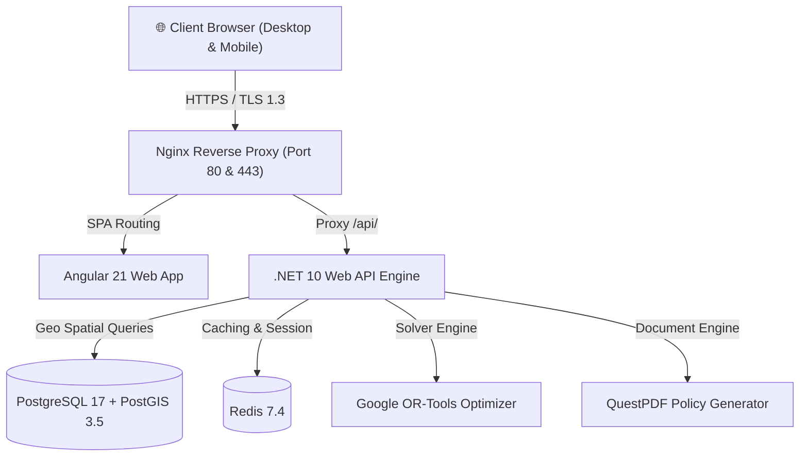

# 🛡️ BRANTAS
> **Basis Rekomendasi & Analisis Terpadu Anggaran Sosial**  
> *Poverty Eradication & Fiscal Intelligence Platform*

---

## 🌐 Live Production URL
Sistem BRANTAS dapat diakses langsung secara publik:
- **Production URL**: [https://brantas-batii.online](https://brantas-batii.online)
- **Direct VPS IP**: [http://43.133.153.177](http://43.133.153.177)

---

## 📌 Fitur Utama Platform

1. **Executive Macro Dashboard**:
   - Analisis kemiskinan makro nasional (514 kabupaten/kota).
   - Metrik kemiskinan terpadu (Tingkat Kemiskinan, Indeks Kedalaman P1, Indeks Keparahan P2).
   - Analisis korelasi fiskal dengan *Corridor Poverty-Fiscal*.

2. **Peta Spasial Risiko Bencana & Kemiskinan**:
   - Integrasi GeoJSON 514 daerah dengan layer risiko BNPB (IRBI - Indeks Risiko Bencana Indonesia).
   - Overlay multi-bencana (Banjir, Longsor, Gempa, Cuaca Ekstrem, dsb).
   - Filter dinamis berdasarkan tingkat risiko (*Sangat Tinggi, Tinggi, Sedang, Rendah*).

3. **Prescriptive Fiscal Optimization Engine**:
   - Mesin optimasi alokasi anggaran berbasis **Google OR-Tools**.
   - Simulasi alokasi anggaran interaktif secara real-time.
   - Analisis sensitivitas intervensi bantuan sosial.

4. **Deteksi Anomali & Integritas Penyaluran**:
   - Algoritma isolasi hutan (Isolation Forest / Outlier Detection) untuk mendeteksi deviasi penyerapan anggaran sosial.
   - Estimasi *Value-at-Risk* fiskal daerah.

5. **AI Assistant "JUSI" & Pelaporan Eksekutif**:
   - Chatbot analitik kebijakan sosial berbasis konteks fiskal nasional.
   - Generator dokumen Policy Brief resmi siap cetak (QuestPDF).

---

## 🏗️ Arsitektur Teknologi

---

## 🚀 CI / CD Pipeline

Repository ini dilengkapi dengan **Continuous Deployment** otomatis via GitHub Actions:
- Setiap perubahan yang di-push ke branch `main` secara otomatis:
  1. Terhubung secara aman ke server VPS melalui SSH.
  2. Melakukan sinkronisasi kode terbaru (`git pull`).
  3. Menjalankan rebuild kontainer produksi Docker Compose.
  4. Melakukan verifikasi kesehatan layanan secara otomatis.
