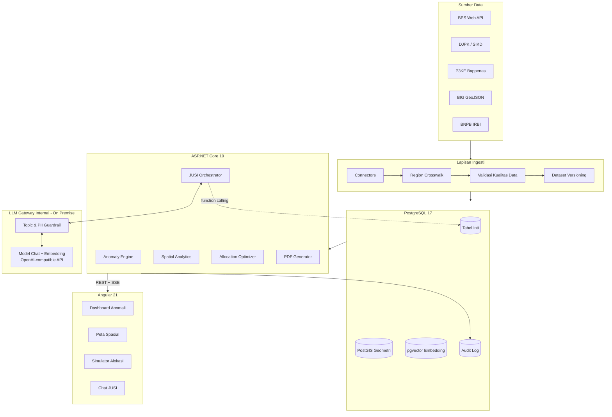
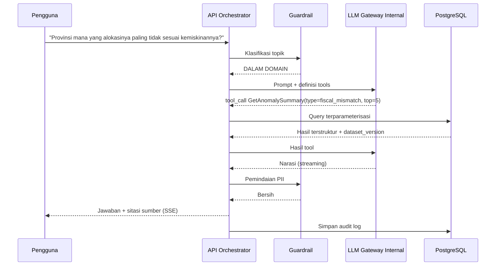
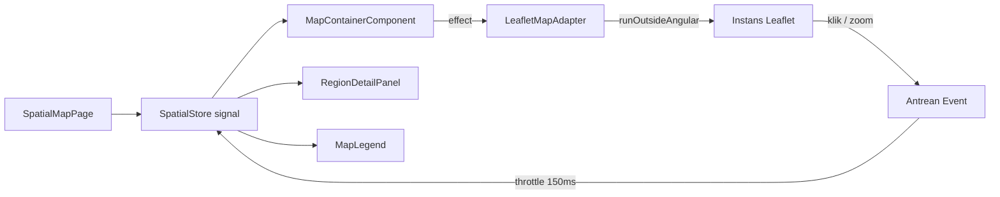

# BUSINESS REQUIREMENTS DOCUMENT (BRD)
## BRANTAS — Basis Rekomendasi & Analisis Terpadu Anggaran Sosial

| | |
|---|---|
| **Versi** | 1.0 |
| **Tanggal** | 2 September 2026 |
| **Konteks** | LAN Datathon 2026 — Subtopik Pengentasan Kemiskinan Berbasis Data |
| **Instansi** | Pusat Pengembangan Sistem Informasi, Badan Teknologi, Informasi, dan Intelijen Keuangan (BaTii) — Kementerian Keuangan RI |
| **Tim** | Andy Pratama (Software Architect & Data Engineer), Okky Sutaryatna (Full-Stack & AI Engineer) |
| **Acuan** | `PROPOSAL LAN Datathon 2026_BRANTAS.pdf` (5 halaman) |
| **Status** | Draft untuk implementasi MVP |

---

## 1. LATAR BELAKANG & PERNYATAAN MASALAH

### 1.1 Kondisi Saat Ini
Anggaran Perlindungan Sosial APBN meningkat dari Rp493,5 T (2024) → Rp504,7 T (2025) → Rp508,2 T (2026), namun penurunan angka kemiskinan melambat (9,03% → 8,25% → 8,07%). Terdapat **paradoks efektivitas fiskal**: kenaikan belanja tidak proporsional dengan penurunan kemiskinan.

### 1.2 Akar Masalah
| Kode | Masalah | Dampak Terukur |
|---|---|---|
| **P-01** | Salah sasaran (inclusion & exclusion error) | ASN/TNI/Polri aktif & keluarga mampu terdaftar penerima; ±2,3 juta keluarga miskin ekstrem terlewat |
| **P-02** | Fragmentasi data antar-instansi (DTKS, P3KE, Regsosek, SIKD) | Tidak ada single source of truth; rekonsiliasi manual 14+ hari |
| **P-03** | Alokasi transfer daerah berbasis formula historis, bukan kebutuhan riil | Daerah dengan kemiskinan ekstrem menerima porsi setara daerah sejahtera |
| **P-04** | Tidak ada instrumen pengukuran dampak intervensi | Kebijakan tidak dapat dievaluasi berbasis bukti |

### 1.3 Peluang
Konsolidasi 5 sumber data resmi + analitik deterministik yang *explainable* dapat memangkas waktu analisis dari 14 hari menjadi <10 menit dan mengidentifikasi potensi efisiensi anggaran Rp10–25 T/tahun.

---

## 2. TUJUAN & SASARAN

### 2.1 Tujuan Bisnis
| Kode | Tujuan | Indikator Keberhasilan (KPI) |
|---|---|---|
| **G-01** | Meningkatkan akurasi penargetan bansos | Terdeteksi ≥95% anomali yang ditanam pada dataset uji |
| **G-02** | Mempercepat siklus analisis alokasi | Pipeline ETL + skoring 38 provinsi selesai < 10 menit |
| **G-03** | Menyediakan dasar alokasi berbasis bukti | Simulasi alokasi dapat direproduksi & diaudit 100% |
| **G-04** | Menjamin kedaulatan data | 0 byte data fiskal/personal keluar dari infrastruktur internal |
| **G-05** | Mempercepat penyusunan naskah kebijakan | Policy brief PDF ter-generate < 30 detik |

### 2.2 Batasan Tegas (Non-Goals)
- BRANTAS **bukan** sistem penyaluran/pembayaran bansos.
- BRANTAS **tidak** menggantikan penetapan DTKS oleh Kemensos; keluarannya adalah **rekomendasi**, bukan keputusan final.
- MVP **tidak** memproses data NIK produksi. Menggunakan dataset sintetis berlabel jelas.

---

## 3. RUANG LINGKUP

### 3.1 In-Scope (MVP Demo Day)
1. Modul Ingesti & Rekonsiliasi Data (ETL 5 sumber)
2. Modul Deteksi Anomali (statistik + rule + opsional ONNX)
3. Modul Analitik Spasial & Peta Interaktif (38 provinsi + 514 kab/kota)
4. Modul Simulasi & Optimasi Alokasi Anggaran
5. Modul Asisten AI "JUSI" (RAG + function calling via LLM Gateway internal)
6. Modul Generator Policy Brief (PDF)
7. Modul Autentikasi, Otorisasi (RBAC), dan Audit Trail

### 3.2 Out-of-Scope (Fase Lanjutan)
- Granularitas desa (kelurahan)
- Notifikasi email/WhatsApp otomatis
- Integrasi API produksi instansi (MVP memakai snapshot dataset)
- Mobile native app
- Retraining model ML otomatis (MLOps)

### 3.3 Penyelarasan dengan Proposal Resmi

Proposal menetapkan **5 Pilar Solusi**. Pemetaannya ke modul BRD ini:

| Pilar Proposal | Modul BRD | Catatan Penyesuaian |
|---|---|---|
| 1. Pendataan — *Automated Multi-Source Data Pipeline* | §5.1 FR-DATA | Sesuai |
| 2. Validasi — *Cross-Dataset Anomaly & Consistency Checker* | §5.2 FR-ANOM | Sesuai |
| 3. Pemetaan — *Spatial AI Choropleth Heatmap* | §5.3 FR-GEO | Proposal menyebut hingga **kecamatan**; MVP menargetkan kab/kota, kecamatan pada 3 provinsi pilot sebagai bukti kemampuan |
| 4. Prioritisasi — *Vulnerability Scoring & Allocation Optimizer* | §5.4 FR-OPT | Sesuai |
| 5. Kebijakan & Monitoring — *Causal Policy Evaluator* | §5.8 FR-CAUSAL | **Dinaikkan menjadi Must-Have.** Versi awal BRD keliru menempatkannya di luar lingkup, padahal proposal menjadikannya pilar inti |

Tiga komitmen teknis eksplisit dalam proposal yang bersifat **wajib** dan tidak boleh diganti:
- **PrimeNG** sebagai pustaka komponen UI
- **Microsoft.ML.OnnxRuntime** sebagai mesin inferensi ML native di C#
- **Microsoft Semantic Kernel .NET SDK** sebagai orkestrator LLM

> **Penyesuaian:** proposal menyebut Ollama sebagai runtime LLM. Instansi telah memiliki **LLM Gateway internal on-premise** yang siap pakai, sehingga runtime tersebut digantikan (lihat §7.6). Substansi komitmen — *Sovereign AI*, model open-source, nol pengiriman data ke luar — tetap terpenuhi, bahkan dengan risiko penyediaan yang lebih rendah.

---

## 4. PEMANGKU KEPENTINGAN & PERAN SISTEM

| Aktor | Instansi | Kebutuhan Utama | Peran RBAC |
|---|---|---|---|
| Analis Fiskal Pusat | Kemenkeu (DJPK/BKF) | Simulasi alokasi TKDD, deteksi anomali nasional | `ANALYST` |
| Perencana Nasional | Bappenas, Kemenko PMK | Peta kantong kemiskinan, prioritas program | `ANALYST` |
| Perencana Daerah | Bappeda, Dinsos | Detail wilayah sendiri, daftar anomali lokal | `REGIONAL` (scoped) |
| Auditor | BPK, BPKP, Itjen | Audit trail, reproducibility hasil simulasi | `AUDITOR` (read-only + log) |
| Pimpinan / Eselon I | Kemenkeu | Ringkasan eksekutif, policy brief | `EXECUTIVE` |
| Administrator | Tim TI | Konfigurasi pipeline, manajemen pengguna | `ADMIN` |

---

## 5. KEBUTUHAN FUNGSIONAL

### 5.1 Modul Ingesti & Rekonsiliasi Data (FR-DATA)

| ID | Kebutuhan | Prioritas |
|---|---|---|
| FR-DATA-01 | Sistem menyediakan konektor untuk 5 sumber: BPS (Web API/CSV), DJPK Kemenkeu (SIKD/CSV), P3KE Bappenas (agregat), BIG (GeoJSON/SHP), BNPB (IRBI) | Must |
| FR-DATA-02 | Sistem memetakan kode wilayah lintas instansi (BPS ↔ Kemendagri Permendagri 72/2019) melalui tabel master `region_crosswalk` | Must |
| FR-DATA-03 | Sistem menjalankan pipeline ETL berbasis job (idempotent, dapat diulang) dengan pelaporan progres real-time via SSE | Must |
| FR-DATA-04 | Sistem melakukan validasi kualitas data: kelengkapan, rentang nilai, konsistensi agregat provinsi vs total kab/kota | Must |
| FR-DATA-05 | Sistem menyimpan setiap eksekusi pipeline sebagai *dataset version* (snapshot) agar hasil analisis dapat direproduksi | Must |
| FR-DATA-06 | Sistem menyederhanakan geometri poligon (Douglas–Peucker via `ST_SimplifyPreserveTopology`) untuk penyajian peta | Must |
| FR-DATA-07 | Sistem mendukung unggah manual berkas CSV/XLSX bila konektor otomatis tidak tersedia | Should |
| FR-DATA-08 | Seluruh sumber data diakses melalui antarmuka `IDataSourceConnector` yang seragam, sehingga sumber **sintetis** dan **riil** dapat dipertukarkan lewat konfigurasi tanpa perubahan kode di lapisan lain (§10.2) | Must |
| FR-DATA-09 | Tersedia generator data sintetis terkalibrasi sesuai SPEC-SYNTH (§10.4), deterministik terhadap *seed* | Must |

### 5.2 Modul Deteksi Anomali (FR-ANOM)

| ID | Kebutuhan | Prioritas |
|---|---|---|
| FR-ANOM-01 | **Anomali Fiskal-Sosial:** mendeteksi ketidakselarasan antara tingkat kemiskinan dan alokasi anggaran per kapita menggunakan residual regresi + z-score (ambang \|z\| > 2,0) | Must |
| FR-ANOM-02 | **Anomali Kepesertaan:** mendeteksi (a) penerima berstatus ASN/TNI/Polri aktif, (b) NIK duplikat, (c) NIK terdaftar meninggal, (d) penerima dengan indikator kemampuan ekonomi (aset/kendaraan) | Must |
| FR-ANOM-03 | **Exclusion Error:** mengidentifikasi wilayah dengan gap antara estimasi keluarga Desil 1–2 dan jumlah penerima terdaftar | Must |
| FR-ANOM-04 | Setiap anomali memiliki **skor keyakinan (0–100)**, **kategori severitas** (Kritis/Tinggi/Sedang/Rendah), dan **penjelasan naratif** faktor pemicu | Must |
| FR-ANOM-05 | Sistem menjalankan model ML terlatih (Isolation Forest / LOF, dilatih di scikit-learn dan diekspor ke `.onnx`) melalui **Microsoft.ML.OnnxRuntime** secara native di backend, sebagai deteksi anomali multivariat | Must |
| FR-ANOM-06 | Pengguna dapat menandai anomali sebagai *Valid / False Positive / Dalam Verifikasi*, tersimpan sebagai umpan balik | Should |
| FR-ANOM-07 | Sistem mengestimasi **nilai rupiah berisiko** (Rp at Risk) dari total anomali terdeteksi | Must |

### 5.3 Modul Analitik Spasial (FR-GEO)

| ID | Kebutuhan | Prioritas |
|---|---|---|
| FR-GEO-01 | Peta koroplet interaktif 38 provinsi dengan drill-down ke 514 kabupaten/kota | Must |
| FR-GEO-02 | Pengguna dapat mengganti layer indikator: % kemiskinan, P1, P2, IPM, anggaran per kapita, skor kerentanan, kepadatan anomali | Must |
| FR-GEO-03 | Sistem menghitung **autokorelasi spasial** (Global & Local Moran's I) untuk mengklasifikasikan wilayah: High-High (kantong kemiskinan), Low-Low, High-Low & Low-High (outlier) | Must |
| FR-GEO-04 | Sistem menyediakan panel detail wilayah saat poligon diklik (statistik, anomali, rekomendasi alokasi) | Must |
| FR-GEO-05 | Sistem menyajikan tile/GeoJSON tersimplifikasi berjenjang sesuai level zoom, target payload < 2 MB per level | Must |
| FR-GEO-06 | Pengguna dapat mengekspor peta sebagai PNG dan data wilayah sebagai CSV/GeoJSON | Should |

### 5.4 Modul Simulasi & Optimasi Alokasi (FR-OPT)

| ID | Kebutuhan | Prioritas |
|---|---|---|
| FR-OPT-01 | Sistem menghitung **Indeks Kerentanan Wilayah (IKW)** sebagai komposit ternormalisasi (min–max) dari: tingkat kemiskinan, P1, P2, (100−IPM), invers PDRB per kapita, indeks risiko bencana | Must |
| FR-OPT-02 | Pengguna dapat mengatur bobot tiap komponen melalui slider (total bobot ternormalisasi = 100%) | Must |
| FR-OPT-03 | Sistem menghitung rekomendasi alokasi = `pagu_total × (IKW_wilayah × populasi_miskin) / Σ(IKW × populasi_miskin)` | Must |
| FR-OPT-04 | Sistem menerapkan batasan kebijakan: (a) *floor* minimum per wilayah, (b) *cap* perubahan maksimum terhadap baseline (mis. ±25%) untuk menjaga stabilitas fiskal | Must |
| FR-OPT-05 | Sistem menampilkan komparasi **Baseline vs Rekomendasi** (delta Rp & %) per wilayah, dengan daftar 10 penerima kenaikan & penurunan terbesar | Must |
| FR-OPT-06 | Sistem menampilkan indikator pemerataan: **Koefisien Gini alokasi** dan rasio alokasi per penduduk miskin sebelum/sesudah | Should |
| FR-OPT-07 | Skenario simulasi dapat disimpan, diberi nama, dibandingkan berdampingan, dan dibagikan via tautan permanen | Should |
| FR-OPT-08 | Setiap hasil simulasi menyimpan `dataset_version_id` + parameter bobot agar 100% dapat direproduksi | Must |

### 5.5 Modul Asisten AI "JUSI" (FR-LLM)

| ID | Kebutuhan | Prioritas |
|---|---|---|
| FR-LLM-01 | JUSI menjawab pertanyaan bahasa Indonesia seputar data kemiskinan, anggaran, anomali, dan hasil simulasi | Must |
| FR-LLM-02 | **Grounding wajib:** jawaban numerik harus berasal dari pemanggilan fungsi ke database, bukan dari parameter model. LLM hanya menyusun narasi atas data terambil | Must |
| FR-LLM-03 | Tools yang tersedia bagi LLM: `GetRegionStats`, `CompareRegions`, `GetAnomalySummary`, `GetAllocationRecommendation`, `SearchPolicyDocuments`, `GetNationalTrend` | Must |
| FR-LLM-04 | **Guardrail input:** klasifikasi topik sebelum inferensi; pertanyaan di luar domain (politik praktis, opini pribadi, hiburan, saran hukum) ditolak dengan pesan sopan berbahasa Indonesia | Must |
| FR-LLM-05 | **Guardrail output:** deteksi & blokir kebocoran PII (pola NIK 16 digit, NKK) pada respons | Must |
| FR-LLM-06 | Jawaban menyertakan **sitasi sumber** (sumber data + periode + versi dataset) | Must |
| FR-LLM-07 | Respons di-*stream* token-per-token melalui SSE | Must |
| FR-LLM-08 | Tersedia mekanisme *fallback* deterministik (template + query DB) bila LLM Gateway tidak terjangkau atau melewati batas waktu | Must |
| FR-LLM-09 | Basis pengetahuan RAG memuat: metodologi BPS, regulasi TKDD/Dana Desa (Portal JDIH Kemenkeu), glosarium indikator; vektor dihasilkan oleh endpoint embedding gateway dan disimpan di `pgvector` | Should |
| FR-LLM-10 | Seluruh percakapan tercatat dalam audit log (prompt, tool calls, respons, latensi) | Must |

### 5.6 Modul Policy Brief & Pelaporan (FR-RPT)

| ID | Kebutuhan | Prioritas |
|---|---|---|
| FR-RPT-01 | Sistem menghasilkan naskah telaahan kebijakan PDF berformat resmi kementerian (kop, nomor, ringkasan eksekutif, analisis, rekomendasi, lampiran data) | Must |
| FR-RPT-02 | PDF memuat visual: peta koroplet, grafik komparasi alokasi, tabel top-N wilayah prioritas | Must |
| FR-RPT-03 | Narasi analisis disusun oleh JUSI berdasarkan data simulasi aktif, dapat disunting sebelum dicetak | Must |
| FR-RPT-04 | Setiap PDF memuat metadata reproduksibilitas: versi dataset, parameter bobot, timestamp, penyusun, dan checksum | Must |
| FR-RPT-05 | Ekspor tambahan: XLSX (data alokasi) dan CSV (daftar anomali) | Should |

### 5.7 Modul Keamanan & Audit (FR-SEC)

| ID | Kebutuhan | Prioritas |
|---|---|---|
| FR-SEC-01 | Autentikasi berbasis JWT dengan refresh token; siap integrasi SSO/OIDC instansi | Must |
| FR-SEC-02 | Otorisasi RBAC 5 peran (§4) dengan pembatasan cakupan wilayah untuk peran `REGIONAL` | Must |
| FR-SEC-03 | Audit trail mencatat: aktor, aksi, entitas, nilai sebelum/sesudah, IP, user agent, waktu (append-only) | Must |
| FR-SEC-04 | Data personal (NIK/NKK) disimpan ter-hash (SHA-256 + salt) dan tidak pernah ditampilkan utuh di UI | Must |
| FR-SEC-05 | Enkripsi in-transit (TLS 1.3) dan at-rest (kolom sensitif) | Must |
| FR-SEC-06 | Rate limiting pada endpoint publik dan endpoint LLM | Should |

### 5.8 Modul Evaluasi Kausal Kebijakan (FR-CAUSAL) — *Pilar 5 Proposal*

| ID | Kebutuhan | Prioritas |
|---|---|---|
| FR-CAUSAL-01 | Sistem mengestimasi dampak intervensi fiskal terhadap tingkat kemiskinan menggunakan **Difference-in-Differences** dengan panel wilayah×tahun dan *two-way fixed effects* | Must |
| FR-CAUSAL-02 | Pengguna dapat menentukan kelompok perlakuan (wilayah dengan kenaikan alokasi di atas ambang) dan kelompok pembanding, atau membiarkan sistem memilih pembanding via *propensity score matching* | Must |
| FR-CAUSAL-03 | Sistem menampilkan koefisien dampak, galat baku *cluster-robust*, selang kepercayaan 95%, dan nilai-p | Must |
| FR-CAUSAL-04 | Sistem menyajikan **uji tren paralel** (event study plot periode pra-perlakuan) sebagai validasi asumsi | Must |
| FR-CAUSAL-05 | Sistem menghitung **efektivitas biaya**: penurunan poin persentase kemiskinan per Rp1 Triliun intervensi | Must |
| FR-CAUSAL-06 | Hasil estimasi disertai peringatan keterbatasan metodologis eksplisit bila asumsi tren paralel tidak terpenuhi | Must |
| FR-CAUSAL-07 | Temuan kausal otomatis dirangkai menjadi bagian "Dasar Bukti" pada Policy Brief | Should |

---

## 6. KEBUTUHAN NON-FUNGSIONAL

| ID | Kategori | Target |
|---|---|---|
| NFR-01 | Performa API | p95 < 500 ms untuk endpoint agregat; < 2 s untuk simulasi 514 wilayah |
| NFR-02 | Performa Peta | First render peta nasional < 3 detik pada koneksi 10 Mbps |
| NFR-03 | Performa ETL | Pipeline penuh 38 provinsi + 514 kab/kota < 10 menit |
| NFR-04 | Latensi LLM | Token pertama < 2 detik; respons lengkap < 15 detik |
| NFR-05 | Skalabilitas | Mendukung 200 pengguna konkuren pada MVP |
| NFR-06 | Ketersediaan | 99% pada jam kerja (target produksi) |
| NFR-07 | Kompatibilitas | Chrome/Edge/Firefox 2 versi terakhir; responsif ≥ 1024 px |
| NFR-08 | Aksesibilitas | WCAG 2.1 AA; palet peta ramah buta warna (ColorBrewer) |
| NFR-09 | Bahasa | Antarmuka & keluaran AI 100% Bahasa Indonesia formal |
| NFR-10 | Kedaulatan Data | Seluruh komponen dapat berjalan on-premise/air-gapped |
| NFR-11 | Observabilitas | Structured logging (Serilog), health check, metrik OpenTelemetry |
| NFR-12 | Reproduksibilitas | Setiap keluaran analitik dapat direkonstruksi dari versi dataset + parameter |

---

## 7. ARSITEKTUR SOLUSI

### 7.1 Tumpukan Teknologi

| Lapisan | Teknologi | Justifikasi |
|---|---|---|
| Frontend | Angular 21 (standalone, signals, zoneless) | Komitmen proposal; performa tinggi, standar enterprise |
| Komponen UI | **PrimeNG 21** (tema Aura, preset kustom Kemenkeu) | Versi kompatibel dengan Angular 21; komponen enterprise lengkap (DataTable, Slider, Timeline) |
| Peta | Leaflet 1.9 + GeoJSON tersimplifikasi | Ringan, tanpa lisensi berbayar & tanpa dependensi token eksternal (Mapbox GL memerlukan akses token — bertentangan dengan asas air-gapped) |
| Grafik | Apache ECharts 6 | Komitmen proposal; kaya tipe visualisasi |
| Backend | ASP.NET Core 10 (Clean Architecture, Minimal API) | Komitmen proposal; standar kementerian |
| ORM | EF Core 10 + Npgsql + NetTopologySuite | Dukungan spasial native |
| Database | PostgreSQL 17 + PostGIS 3.5 + pgvector | Relasional + geospasial + vektor dalam satu mesin |
| Inferensi ML | **Microsoft.ML.OnnxRuntime** | Komitmen proposal; model dilatih di Python (scikit-learn), diekspor `.onnx`, dieksekusi native di C# |
| Analitik statistik | MathNet.Numerics | Statistik deterministik & explainable sebagai pendamping model ONNX |
| Optimasi | Google OR-Tools (.NET) | Linear programming dengan constraint kebijakan |
| Evaluasi kausal | MathNet.Numerics (OLS, panel fixed-effect) | Difference-in-Differences & event study |
| LLM | **LLM Gateway internal (OpenAI-compatible)** — sudah tersedia, on-premise | Aset eksisting; menghilangkan risiko penyediaan & memperkuat klaim Sovereign AI |
| Embedding | Endpoint embedding pada gateway yang sama | Konsistensi vektor RAG dengan model generatif |
| Orkestrasi AI | **Microsoft Semantic Kernel .NET SDK** (`OpenAIChatCompletion` diarahkan ke base URL internal) | Komitmen proposal; function calling & abstraksi provider |
| PDF | QuestPDF | Layout deklaratif, lisensi community |
| Job/Cache | Hangfire + Redis | Pipeline ETL terjadwal & caching agregat |
| Deployment | Docker Compose (MVP) → Kubernetes (produksi) | Portabel, on-premise ready |

### 7.2 Struktur Solusi Backend

```
Brantas.sln
├─ src/
│  ├─ Brantas.Domain/            # Entitas, value object, aturan bisnis murni
│  ├─ Brantas.Application/       # Use case, CQRS handler, kontrak (interface)
│  ├─ Brantas.Infrastructure/    # EF Core, PostGIS, klien LLM Gateway, ETL connector
│  ├─ Brantas.Analytics/         # Anomali, Moran's I, IKW, optimizer OR-Tools
│  ├─ Brantas.Reporting/         # QuestPDF templates
│  └─ Brantas.Api/               # Minimal API endpoints, auth, SSE
└─ tests/
   ├─ Brantas.UnitTests/
   └─ Brantas.IntegrationTests/
```

### 7.3 Diagram Alur Sistem



### 7.4 Alur Grounding JUSI



---

## 7.5 ARSITEKTUR FRONTEND (RINCI)

> **Catatan:** Prototipe `fe app/` yang ada saat ini adalah *mockup* dengan data statis. Prototipe tersebut **tidak dijadikan basis kode**. Aplikasi frontend dibangun ulang dari nol mengikuti arsitektur di bawah. Data pada mockup hanya dipakai sebagai referensi *seed* database.

### 7.5.1 Prinsip Arsitektur

| # | Prinsip | Implikasi Teknis |
|---|---|---|
| 1 | **Feature-based, bukan type-based** | Kode dikelompokkan per domain bisnis, bukan per jenis berkas |
| 2 | **Zoneless + Signals** | `provideZonelessChangeDetection()`; tanpa Zone.js; seluruh state reaktif memakai signal |
| 3 | **Standalone components** | Tanpa `NgModule`; dependensi eksplisit per komponen |
| 4 | **Dumb/Smart separation** | Komponen presentasional murni `input()`/`output()`; logika di *facade* per fitur |
| 5 | **Kontrak API sebagai sumber kebenaran** | Tipe TypeScript digenerate dari OpenAPI backend, tidak ditulis tangan |
| 6 | **Lazy by default** | Setiap rute `loadComponent`; pustaka berat (Leaflet, ECharts) dimuat via `@defer` |
| 7 | **Tanpa state global tunggal** | Tiap fitur punya store sendiri; hanya sesi & referensi wilayah yang global |

### 7.5.2 Struktur Direktori

```
brantas-web/
├─ src/
│  ├─ app/
│  │  ├─ core/                        # Singleton, dimuat sekali
│  │  │  ├─ auth/                     # authStore, guard, interceptor JWT, refresh
│  │  │  ├─ http/                     # interceptor: error, correlation-id, retry, loading
│  │  │  ├─ api/                      # KLIEN TERGENERATE dari OpenAPI (jangan disunting)
│  │  │  ├─ streaming/                # SseClient (pipeline & chat)
│  │  │  ├─ config/                   # AppConfig, runtime env loader
│  │  │  └─ telemetry/                # logger, error handler global
│  │  │
│  │  ├─ shared/                      # Reusable, bebas domain
│  │  │  ├─ ui/                       # KpiCard, SeverityBadge, EmptyState, DataBadge
│  │  │  ├─ directives/               # hasRole, autoFocus, resizeObserver
│  │  │  ├─ pipes/                    # rupiah, persen, angkaRingkas, tanggalId
│  │  │  └─ util/                     # normalisasi, format, guard tipe
│  │  │
│  │  ├─ layout/                      # Shell aplikasi
│  │  │  ├─ shell/                    # AppShell: topbar + sidebar + router-outlet
│  │  │  ├─ topbar/                   # pemilih periode, versi dataset, profil, notifikasi
│  │  │  └─ sidebar/                  # navigasi tersaring berdasarkan peran
│  │  │
│  │  ├─ features/
│  │  │  ├─ dashboard/                # Modul 1 - KPI & ringkasan anomali
│  │  │  │  ├─ pages/
│  │  │  │  ├─ components/
│  │  │  │  ├─ data/                  # dashboard.service.ts (panggil core/api)
│  │  │  │  └─ state/                 # dashboard.store.ts (signal store)
│  │  │  ├─ pipeline/                 # Modul 1 - ETL, progres SSE, kualitas data
│  │  │  ├─ anomaly/                  # Modul 1 - daftar, detail, verifikasi
│  │  │  ├─ spatial/                  # Modul 2 - peta koroplet & Moran's I
│  │  │  │  ├─ map/                   # wrapper Leaflet (di luar Angular CD)
│  │  │  │  └─ layers/                # definisi layer & skala warna
│  │  │  ├─ optimizer/                # Modul 3 - simulasi alokasi
│  │  │  ├─ causal/                   # Pilar 5 - DiD & event study
│  │  │  ├─ jusi/                     # Modul 4 - chat streaming
│  │  │  ├─ reports/                  # Modul 4 - policy brief
│  │  │  └─ admin/                    # pengguna, peran, audit log
│  │  │
│  │  ├─ app.config.ts                # providers akar
│  │  └─ app.routes.ts                # rute akar (lazy)
│  │
│  ├─ assets/
│  │  ├─ geo/                         # GeoJSON fallback tersimplifikasi
│  │  └─ i18n/id.json
│  ├─ styles/
│  │  ├─ theme/                       # preset PrimeNG kustom (palet Kemenkeu)
│  │  └─ tokens.css                   # design token: warna, spasi, tipografi
│  └─ main.ts
└─ e2e/                               # Playwright
```

### 7.5.3 Peta Rute & Kontrol Akses

| Rute | Komponen | Peran | Strategi Muat |
|---|---|---|---|
| `/masuk` | LoginPage | Publik | Eager |
| `/beranda` | DashboardPage | Semua | Lazy + resolver KPI |
| `/pipeline` | PipelinePage | ADMIN | Lazy |
| `/anomali` | AnomalyListPage | ANALYST, AUDITOR, EXECUTIVE | Lazy + virtual scroll |
| `/anomali/:id` | AnomalyDetailPage | ANALYST, AUDITOR | Lazy |
| `/peta` | SpatialMapPage | Semua | Lazy + `@defer` Leaflet |
| `/simulasi` | OptimizerPage | ANALYST | Lazy |
| `/simulasi/:id/banding` | ScenarioComparePage | ANALYST, EXECUTIVE | Lazy |
| `/dampak` | CausalEvaluationPage | ANALYST | Lazy + `@defer` ECharts |
| `/jusi` | ChatPage | Semua | Lazy |
| `/laporan` | PolicyBriefPage | ANALYST, EXECUTIVE | Lazy |
| `/admin/audit` | AuditLogPage | AUDITOR, ADMIN | Lazy |

Guard: `authGuard` (sesi valid) → `roleGuard(...)` (peran) → `regionScopeGuard` (peran `REGIONAL` hanya wilayahnya).

### 7.5.4 Pola Pengelolaan State

Setiap fitur memiliki satu *store* berbasis signal. Tidak memakai NgRx penuh; cukup `signalStore` dari `@ngrx/signals` untuk konsistensi pola.

```ts
// features/optimizer/state/optimizer.store.ts (pola, bukan implementasi final)
export const OptimizerStore = signalStore(
  { providedIn: 'root' },
  withState<OptimizerState>({
    weights: DEFAULT_WEIGHTS,
    totalBudget: 0,
    constraints: DEFAULT_CONSTRAINTS,
    results: [],
    status: 'idle',
  }),
  withComputed(({ results, weights }) => ({
    // Turunan murni — tidak pernah disimpan sebagai state
    topGainers: computed(() => [...results()].sort((a, b) => b.deltaPct - a.deltaPct).slice(0, 10)),
    weightsValid: computed(() => Math.abs(sum(Object.values(weights())) - 1) < 1e-6),
  })),
  withMethods((store, api = inject(OptimizerApi)) => ({
    // Slider di-debounce agar tidak membanjiri backend
    runSimulation: rxMethod<SimulationRequest>(pipe(
      debounceTime(300),
      distinctUntilChanged(deepEqual),
      tap(() => patchState(store, { status: 'running' })),
      switchMap(req => api.simulate(req).pipe(
        tapResponse({
          next: r => patchState(store, { results: r.allocations, status: 'idle' }),
          error: () => patchState(store, { status: 'error' }),
        }),
      )),
    )),
  })),
);
```

**Aturan wajib:**
- Nilai turunan **selalu** `computed()`, tidak pernah disimpan ganda sebagai state.
- Panggilan HTTP hanya dari lapisan `data/`, tidak pernah langsung dari komponen.
- `switchMap` untuk permintaan yang dapat dibatalkan (simulasi, pencarian); `concatMap` untuk aksi yang harus berurutan.

### 7.5.5 Lapisan Komunikasi Backend

| Kebutuhan | Mekanisme | Catatan |
|---|---|---|
| CRUD & query | `HttpClient` + klien tergenerate OpenAPI | `orval` / `ng-openapi-gen` pada langkah build |
| Progres pipeline ETL | **SSE** `/api/pipeline/stream/{jobId}` | `SseClient` berbasis `EventSource`, di-*unwrap* menjadi signal |
| Streaming jawaban JUSI | **SSE** `/api/chat/.../messages` | Token diakumulasi ke signal; render inkremental |
| GeoJSON wilayah | `HttpClient` + cache `Map` di memori + `Cache-Control` | Payload per level zoom |
| Unduh PDF/XLSX | `responseType: 'blob'` | Progres via `reportProgress` |

**Interceptor berantai (urutan penting):**
1. `correlationIdInterceptor` — sisipkan `X-Correlation-Id` untuk pelacakan lintas layanan
2. `authInterceptor` — sisipkan Bearer token, antre saat refresh berlangsung
3. `retryInterceptor` — *exponential backoff* hanya untuk GET idempoten
4. `errorInterceptor` — petakan RFC 7807 ProblemDetails ke notifikasi PrimeNG Toast
5. `loadingInterceptor` — hitung permintaan aktif untuk indikator global

### 7.5.6 Strategi Komponen Peta

Leaflet bersifat imperatif dan memanipulasi DOM secara langsung. Integrasinya diisolasi ketat:

- Instans peta dibuat di dalam `runOutsideAngular()`; hanya *event* terpilih yang dimasukkan kembali via `NgZone.run()` — meski aplikasi zoneless, isolasi ini tetap dipertahankan agar tidak memicu pembaruan signal berlebih.
- Renderer `L.canvas()` dipakai untuk ribuan poligon; jauh lebih ringan daripada SVG.
- Layer GeoJSON dimuat berjenjang: nasional (provinsi) → saat zoom ≥ 8 baru memuat kab/kota pada *viewport* aktif (`ST_Intersects` di sisi server).
- Skala warna memakai palet sekuensial ColorBrewer ramah buta warna, dengan klasifikasi *quantile* dan legenda dinamis.
- Perubahan indikator hanya memutakhirkan `setStyle()` per layer, tidak membangun ulang layer.



### 7.5.7 Antarmuka JUSI (Streaming)

- Pesan pengguna dikirim via POST; respons diterima sebagai aliran SSE bertipe: `token`, `tool_call`, `citation`, `done`, `error`.
- Peristiwa `tool_call` ditampilkan sebagai indikator transparan ("Mengambil data anomali Provinsi Papua…") — ini memperkuat kesan *grounded* di hadapan juri.
- Peristiwa `citation` dirender sebagai chip sumber di bawah jawaban.
- Markdown di-render dengan sanitasi ketat (tanpa HTML mentah) untuk mencegah XSS.
- Tombol batal membatalkan `AbortController` dan menutup koneksi SSE.

### 7.5.8 Sistem Desain & Tema

- **PrimeNG 21** dengan *theming* berbasis token CSS, preset kustom `BrantasPreset` menurunkan Aura.
- Palet utama mengikuti identitas Kemenkeu: `#003366` (primer), aksen `#2563eb`, semantik severitas: Kritis `#dc2626`, Tinggi `#d97706`, Sedang `#ca8a04`, Rendah `#059669`.
- Dukungan mode terang & gelap melalui `[data-theme]`, disimpan di `localStorage`.
- Tipografi: Plus Jakarta Sans (UI), JetBrains Mono (angka & kode) — konsisten dengan slide presentasi.
- Komponen PrimeNG kunci: `p-table` (virtual scroll + lazy), `p-slider`, `p-select`, `p-timeline` (progres pipeline), `p-toast`, `p-drawer`, `p-skeleton`.
- **Badge "Data Simulasi"** wajib dirender oleh komponen bersama `DataProvenanceBadge` pada setiap tampilan bersumber data sintetis (lihat §10).

### 7.5.9 Performa

| Teknik | Target |
|---|---|
| Zoneless change detection | Menghilangkan pemeriksaan menyeluruh yang tidak perlu |
| `@defer (on viewport)` untuk ECharts & Leaflet | Bundel awal < 300 KB terkompresi |
| Virtual scroll `p-table` untuk daftar anomali | Render 10.000 baris tanpa jank |
| Debounce 300 ms pada slider simulasi | Mencegah badai permintaan |
| `httpResource` / cache in-memory untuk data referensi wilayah | Nol permintaan berulang |
| Kompresi Brotli + `Cache-Control: immutable` untuk GeoJSON | Muat ulang peta instan |
| Preload rute prioritas setelah aplikasi idle | Navigasi terasa instan |

### 7.5.10 Kualitas & Pengujian

| Lapisan | Alat | Cakupan Target |
|---|---|---|
| Unit (store, pipe, util) | Vitest | ≥ 80% |
| Komponen | Vitest + Angular Testing Library | Jalur kritis |
| Kontrak API | MSW (mock berbasis skema OpenAPI) | Semua endpoint |
| End-to-end | Playwright | 8 skenario penerimaan §13 |
| Aksesibilitas | axe-core dalam Playwright | 0 pelanggaran serius |
| Statis | ESLint + Prettier + `strict: true` TypeScript | Wajib lolos di CI |

### 7.5.11 Penanganan Kesalahan & Kondisi Kosong

Setiap tampilan data wajib menangani empat kondisi secara eksplisit: **memuat** (skeleton, bukan spinner), **kosong** (`EmptyState` dengan ajakan aksi), **galat** (pesan Bahasa Indonesia + tombol coba lagi), dan **sebagian** (data tersedia namun sebagian wilayah tidak lengkap — ditandai dengan indikator kelengkapan).

---

## 7.6 INTEGRASI LLM GATEWAY INTERNAL

### 7.6.1 Profil Layanan

| Aspek | Ketentuan |
|---|---|
| Kepemilikan | Layanan **sudah tersedia** milik instansi — tidak perlu disediakan oleh proyek ini |
| Protokol | OpenAI-compatible: `POST {baseUrl}/v1/chat/completions`, `POST {baseUrl}/v1/embeddings` |
| Kemampuan | Chat completion, **tool/function calling**, streaming SSE, embedding |
| Autentikasi | API key via header `Authorization: Bearer <key>` |
| Penempatan | On-premise / jaringan internal — memenuhi NFR-10 (kedaulatan data) |

### 7.6.2 Konfigurasi

Seluruh parameter berbasis konfigurasi. **API key tidak pernah masuk ke repositori** — gunakan .NET User Secrets saat pengembangan dan variabel lingkungan / secret store saat deployment.

```jsonc
// appsettings.json - nilai non-rahasia saja
{
  "LlmGateway": {
    "BaseUrl": "https://llm.internal.kemenkeu.go.id/v1",
    "ChatModel": "<nama-model-chat>",
    "EmbeddingModel": "<nama-model-embedding>",
    "EmbeddingDimensions": 1024,
    "Temperature": 0.1,
    "MaxOutputTokens": 1200,
    "TimeoutSeconds": 20,
    "MaxToolIterations": 5
  }
}
```

`LlmGateway:ApiKey` dipasok terpisah melalui `dotnet user-secrets` atau env `LlmGateway__ApiKey`.

> **Temperature 0,1** disengaja. JUSI menyusun narasi atas angka resmi negara — konsistensi jauh lebih penting daripada variasi bahasa.

### 7.6.3 Registrasi Klien

```csharp
// Brantas.Infrastructure/DependencyInjection.cs (pola)
var llm = configuration.GetSection("LlmGateway").Get<LlmGatewayOptions>()!;

builder.AddOpenAIChatCompletion(
    modelId: llm.ChatModel,
    apiKey: llm.ApiKey,
    endpoint: new Uri(llm.BaseUrl),
    httpClient: resilientClient);

builder.AddOpenAIEmbeddingGenerator(
    modelId: llm.EmbeddingModel,
    apiKey: llm.ApiKey,
    endpoint: new Uri(llm.BaseUrl));
```

`resilientClient` dibangun via `IHttpClientFactory` + `Microsoft.Extensions.Http.Resilience`:
- **Timeout** total 20 detik per permintaan
- **Retry** 2 kali dengan *exponential backoff + jitter*, hanya untuk galat transien (5xx, 408, 429)
- **Circuit breaker** terbuka setelah 5 kegagalan beruntun → memicu jalur fallback FR-LLM-08
- Header `X-Correlation-Id` diteruskan untuk pelacakan lintas layanan

### 7.6.4 Kontrak Tool Calling

Enam fungsi FR-LLM-03 didaftarkan sebagai Semantic Kernel plugin. **Seluruh fungsi bersifat baca-saja** dan menerapkan filter wilayah sesuai peran pengguna — LLM tidak pernah dapat mengakses data di luar cakupan otorisasi pemanggilnya.

| Fungsi | Parameter | Keluaran |
|---|---|---|
| `GetRegionStats` | `regionCode`, `period` | Indikator kemiskinan & fiskal wilayah |
| `CompareRegions` | `regionCodes[]`, `indicator`, `period` | Tabel perbandingan |
| `GetAnomalySummary` | `type?`, `severity?`, `regionCode?`, `top?` | Daftar anomali + nilai berisiko |
| `GetAllocationRecommendation` | `scenarioId?`, `regionCode?` | Baseline vs rekomendasi + delta |
| `GetNationalTrend` | `indicator`, `fromYear`, `toYear` | Deret waktu nasional |
| `SearchPolicyDocuments` | `query`, `topK` | Kutipan regulasi/metodologi dari pgvector |

Setiap keluaran fungsi menyertakan `datasetVersionId` dan `sourceAgency`, yang wajib dirender sebagai sitasi (FR-LLM-06).

Batas `MaxToolIterations = 5` mencegah putaran pemanggilan tak berujung. Bila tercapai tanpa jawaban final, sistem beralih ke fallback deterministik.

### 7.6.5 Urutan Guardrail

```
Input pengguna
  ↓
[1] Normalisasi & batas panjang (maks 1.000 karakter)
  ↓
[2] Klasifikasi topik  — daftar-tolak kata kunci + klasifikasi LLM zero-shot
      └─ di luar domain → penolakan sopan berbahasa Indonesia, tanpa memanggil model utama
  ↓
[3] Deteksi upaya prompt injection ("abaikan instruksi sebelumnya", permintaan bocorkan system prompt)
  ↓
[4] Inferensi + tool calling (data selalu dari database)
  ↓
[5] Pemindaian PII keluaran — pola NIK 16 digit, NKK, nomor rekening → redaksi
  ↓
[6] Validasi sitasi — jawaban memuat angka tanpa hasil tool → tandai & minta ulang sekali
  ↓
Respons ke pengguna + audit log lengkap
```

### 7.6.6 Dampak terhadap Rencana Proyek

| Perubahan | Akibat |
|---|---|
| Tidak perlu menyediakan & menyetel Ollama | Fase 0 & Fase 3 berkurang bebannya |
| Tidak perlu mengunduh bobot model (belasan GB) | Menghilangkan hambatan lingkungan pengembangan |
| Embedding tersedia dari gateway | Tidak perlu model embedding lokal terpisah untuk RAG |
| Kualitas & latensi bergantung pada layanan pihak lain | Wajib ada health check, circuit breaker, dan fallback (sudah diakomodasi) |

---

## 8. MODEL DATA (RINGKAS)

### 8.1 Entitas Inti

| Tabel | Deskripsi | Kolom Kunci |
|---|---|---|
| `regions` | Master wilayah hierarkis | `id`, `bps_code`, `kemendagri_code`, `level` (NASIONAL/PROVINSI/KABKOTA), `parent_id`, `geom` (MultiPolygon 4326), `geom_simplified` |
| `region_crosswalk` | Pemetaan kode lintas instansi | `bps_code`, `kemendagri_code`, `p3ke_code`, `valid_from`, `valid_to` |
| `dataset_versions` | Snapshot hasil ETL | `id`, `source_set`, `period`, `ingested_at`, `record_count`, `checksum`, `status` |
| `poverty_indicators` | Indikator kemiskinan BPS | `region_id`, `dataset_version_id`, `period`, `poverty_rate`, `poor_population`, `p1`, `p2`, `poverty_line`, `ipm`, `gini` |
| `fiscal_allocations` | Realisasi & pagu anggaran | `region_id`, `dataset_version_id`, `fiscal_year`, `dau`, `dak_fisik`, `dak_nonfisik`, `dana_desa`, `bansos_daerah`, `total` |
| `welfare_aggregates` | Agregat P3KE per wilayah | `region_id`, `desil_1_4_families`, `rtlh_count`, `no_sanitation_count`, `registered_beneficiaries` |
| `disaster_risk` | Indeks risiko bencana BNPB | `region_id`, `irbi_score`, `risk_class` |
| `anomalies` | Hasil deteksi | `id`, `region_id`, `dataset_version_id`, `type`, `severity`, `confidence_score`, `value_at_risk`, `explanation`, `detected_at`, `review_status` |
| `beneficiary_records` | Data mikro tersintesis (hash NIK) | `nik_hash`, `nkk_hash`, `region_id`, `program`, `desil`, `employment_flag`, `deceased_flag`, `asset_flag` |
| `simulation_scenarios` | Skenario simulasi tersimpan | `id`, `name`, `owner_id`, `dataset_version_id`, `weights_json`, `total_budget`, `constraints_json`, `created_at` |
| `allocation_results` | Hasil per wilayah per skenario | `scenario_id`, `region_id`, `vulnerability_index`, `baseline_amount`, `recommended_amount`, `delta_pct` |
| `chat_sessions` / `chat_messages` | Riwayat JUSI | `session_id`, `role`, `content`, `tool_calls_json`, `latency_ms`, `token_count` |
| `knowledge_chunks` | RAG korpus | `id`, `source_doc`, `chunk_text`, `embedding vector(768)` |
| `audit_logs` | Jejak audit append-only | `actor_id`, `action`, `entity_type`, `entity_id`, `payload_json`, `ip`, `occurred_at` |
| `users` / `roles` | Pengguna & peran | `id`, `email`, `role`, `region_scope_id` |

### 8.2 Indeks Kritis
- `GIST` pada `regions.geom` dan `regions.geom_simplified`
- `BTREE` komposit pada `(region_id, dataset_version_id, period)` untuk seluruh tabel indikator
- `HNSW` pada `knowledge_chunks.embedding`
- `BRIN` pada `audit_logs.occurred_at`

---

## 9. SPESIFIKASI API (RINGKAS)

| Metode | Endpoint | Deskripsi | Peran |
|---|---|---|---|
| POST | `/api/auth/login` | Autentikasi, terbitkan JWT | Publik |
| GET | `/api/regions?level=&parentId=` | Daftar wilayah | Semua |
| GET | `/api/regions/{id}/profile` | Profil lengkap wilayah | Semua |
| GET | `/api/geo/regions?level=&simplify=` | GeoJSON tersimplifikasi | Semua |
| GET | `/api/indicators/summary?period=` | KPI nasional | Semua |
| POST | `/api/pipeline/run` | Jalankan ETL | ADMIN |
| GET | `/api/pipeline/stream/{jobId}` | Progres ETL (SSE) | ADMIN |
| GET | `/api/anomalies?type=&severity=&regionId=` | Daftar anomali berpaginasi | ANALYST+ |
| GET | `/api/anomalies/summary` | Agregat & Rp at Risk | Semua |
| PATCH | `/api/anomalies/{id}/review` | Ubah status verifikasi | ANALYST |
| GET | `/api/spatial/morans-i?indicator=` | Hasil autokorelasi spasial | ANALYST+ |
| POST | `/api/simulations` | Jalankan & simpan simulasi | ANALYST |
| GET | `/api/simulations/{id}` | Detail hasil simulasi | Semua |
| GET | `/api/simulations/compare?a=&b=` | Bandingkan dua skenario | ANALYST+ |
| POST | `/api/causal/did` | Estimasi Difference-in-Differences | ANALYST |
| GET | `/api/causal/parallel-trends?treatmentId=` | Data event study untuk uji tren paralel | ANALYST |
| POST | `/api/chat/sessions` | Mulai sesi JUSI | Semua |
| POST | `/api/chat/sessions/{id}/messages` | Kirim pesan (respons SSE) | Semua |
| POST | `/api/reports/policy-brief` | Generate PDF | ANALYST+ |
| GET | `/api/audit?actor=&from=&to=` | Query audit log | AUDITOR |

---

## 10. STRATEGI DATA

### 10.1 Pendekatan: Sintetis Terlebih Dahulu

MVP dibangun sepenuhnya di atas **data sintetis terkalibrasi**. Sumber data riil diintegrasikan belakangan tanpa mengubah kode aplikasi.

**Alasan:**
- Pengembangan tidak terblokir oleh ketersediaan, format, atau perizinan portal eksternal
- Bebas risiko UU PDP No. 27/2022 karena tidak ada data pribadi nyata
- Anomali, kluster spasial, dan efek kebijakan **ditanam secara sengaja**, sehingga akurasi sistem dapat diukur objektif (mustahil dilakukan dengan data riil tanpa label kebenaran)
- Dataset deterministik dan dapat direproduksi \u2192 demo tidak pernah berubah perilaku

**Konsekuensi wajib:** Setiap tampilan bersumber data sintetis menampilkan badge **"Data Simulasi"** (§7.5.8), dan setiap PDF memuat disclaimer. Ini disajikan sebagai keunggulan kepatuhan privasi, bukan kekurangan.

### 10.2 Arsitektur Sumber Data yang Dapat Ditukar

Agar peralihan ke data riil tidak menimbulkan penulisan ulang, seluruh ingesti melewati satu abstraksi:

```csharp
public interface IDataSourceConnector
{
    string SourceCode { get; }              // "BPS", "DJPK", "P3KE", "BIG", "BNPB"
    Task<IngestionResult> FetchAsync(IngestionRequest request, CancellationToken ct);
}
```

| Implementasi | Fase | Keterangan |
|---|---|---|
| `SyntheticBpsConnector` dll. | MVP | Membangkitkan data terkalibrasi sesuai §10.4 |
| `HttpBpsConnector` dll. | Pasca-MVP | Memanggil API/berkas resmi |
| `CsvFileConnector` | Kapan saja | Unggah manual (FR-DATA-07) |

Pemilihan implementasi murni berbasis konfigurasi:

```jsonc
{ "DataSources": { "Mode": "Synthetic", "Seed": 20260101 } }
```

Nilai `Seed` tetap menjamin dataset identik di seluruh mesin tim dan saat demo.

### 10.3 Kalibrasi terhadap Angka Resmi

Data sintetis **tidak acak**. Nilai agregat nasional dipatok pada angka resmi publik agar sistem tampil kredibel dan konsisten dengan proposal:

| Parameter | Nilai Patokan | Sumber |
|---|---|---|
| Kemiskinan nasional | 8,07% (22,93 juta jiwa) | BPS Maret 2026 |
| Anggaran Perlinsos | Rp508,2 T | Nota Keuangan RAPBN 2026 |
| Deret historis | 9,03% (2024) → 8,25% (2025) → 8,07% (2026) | BPS |
| Sebaran provinsi | Papua Pegunungan tertinggi, DKI Jakarta terendah | Pola BPS |
| Jumlah wilayah | 38 provinsi, 514 kabupaten/kota | Kemendagri |

Generator menerapkan **penskalaan proporsional** sehingga penjumlahan seluruh kab/kota selalu konsisten dengan agregat provinsi, dan provinsi konsisten dengan nasional. Ini sekaligus membuat aturan validasi FR-DATA-04 dapat diuji.

### 10.4 Spesifikasi Generator (SPEC-SYNTH)

| ID | Ketentuan |
|---|---|
| **SPEC-SYNTH-01** | Seluruh pembangkitan menggunakan PRNG ber-*seed* tetap. Dua eksekusi dengan seed sama menghasilkan dataset byte-identical |
| **SPEC-SYNTH-02** | **Struktur spasial wajib ditanam.** Tingkat kemiskinan kab/kota dibangkitkan sebagai proses autoregresif spasial: $y_i = \mu_p + \rho \sum_j w_{ij} (y_j - \mu_p) + \varepsilon_i$ dengan $\rho \approx 0{,}6$ dan $w$ matriks ketetanggaan Queen. **Tanpa ini, Moran's I ≈ 0 dan fitur kluster kemiskinan tidak akan menghasilkan apa pun saat demo** |
| **SPEC-SYNTH-03** | Indikator berkorelasi wajar: IPM berkorelasi negatif dengan kemiskinan ($r \approx -0{,}7$); PDRB per kapita negatif ($r \approx -0{,}5$); P1 dan P2 diturunkan dari tingkat kemiskinan dengan derau kecil |
| **SPEC-SYNTH-04** | Panel waktu 2020–2026 dibangkitkan sebagai lintasan (*random walk* dengan drift menurun), bukan tahun-tahun independen, agar analisis tren dan uji tren paralel bermakna |
| **SPEC-SYNTH-05** | **Efek kebijakan ditanam:** sekelompok wilayah perlakuan menerima kenaikan alokasi pada 2024, diikuti penurunan kemiskinan tambahan −0,45 pp pada 2025–2026. Nilai kebenaran ini disimpan untuk memvalidasi estimator DiD (FR-CAUSAL) |
| **SPEC-SYNTH-06** | Populasi penerima sintetis: **±2 juta baris**, dengan `nik_hash`/`nkk_hash` (NIK semu ber-*checksum* valid, tidak pernah disimpan mentah), sebaran wilayah proporsional terhadap jumlah penduduk miskin |
| **SPEC-SYNTH-07** | **Anomali ditanam terkontrol** dengan proporsi tercatat: ASN/TNI/Polri aktif 1,2%; NIK duplikat 0,8%; NIK meninggal 0,5%; indikator aset/kemampuan ekonomi 2,0%; exclusion error 3,5% |
| **SPEC-SYNTH-08** | **Ketidakselarasan fiskal ditanam:** 6 provinsi *under-allocated* dan 4 provinsi *over-allocated* secara sengaja, agar FR-ANOM-01 memiliki temuan yang dapat diverifikasi |
| **SPEC-SYNTH-09** | Ketidaklengkapan data disimulasikan: 3–5% nilai hilang secara acak, untuk menguji jalur "data sebagian" pada UI (§7.5.11) dan indikator kelengkapan |
| **SPEC-SYNTH-10** | Seluruh label kebenaran (anomali tertanam, wilayah perlakuan, efek sebenarnya) disimpan pada tabel `synthetic_ground_truth` \u2014 **tidak pernah diekspos melalui API produksi**, hanya dipakai oleh uji otomatis |
| **SPEC-SYNTH-11** | Geometri wilayah menggunakan batas administratif riil dari sumber terbuka (bukan sintetis), karena bentuk wilayah bukan data sensitif dan diperlukan agar matriks ketetanggaan benar |

### 10.5 Nilai Tambah untuk Pengujian

Karena kebenaran diketahui (SPEC-SYNTH-10), kriteria penerimaan menjadi terukur objektif:

| Diuji | Cara |
|---|---|
| Akurasi deteksi anomali (G-01 ≥ 95%) | Bandingkan keluaran mesin dengan `synthetic_ground_truth` \u2192 presisi, recall, F1 |
| Kebenaran Moran's I | Nilai terestimasi harus mendekati $\rho$ yang ditanam |
| Kebenaran estimator DiD | Koefisien harus memuat −0,45 pp dalam selang kepercayaan 95% |
| Konsistensi agregasi | Σ kab/kota = provinsi = nasional, toleransi < 0,01% |

### 10.6 Peta Jalan Migrasi ke Data Riil

| Langkah | Aktivitas |
|---|---|
| 1 | Verifikasi ketersediaan & format sumber resmi (BPS, DJPK, BIG, BNPB, P3KE) |
| 2 | Implementasikan `Http*Connector` di balik antarmuka yang sama |
| 3 | Jalankan keduanya berdampingan; bandingkan distribusi sintetis vs riil |
| 4 | Ubah `DataSources:Mode` menjadi `Real`; **nol perubahan pada Application, Analytics, dan Frontend** |
| 5 | Data mikro penerima **tetap sintetis** hingga tersedia perjanjian berbagi data resmi |

---

## 11. RENCANA IMPLEMENTASI

### Fase 0 — Fondasi
- Inisialisasi solusi .NET Clean Architecture + Docker Compose (Postgres/PostGIS/Redis)
- Uji konektivitas ke LLM Gateway internal (chat + embedding) sebagai gerbang kelayakan Fase 3
- Skema database + migrasi EF Core + seeding master wilayah & crosswalk
- Autentikasi JWT + RBAC + middleware audit
- Kontrak API (OpenAPI) sebagai patokan integrasi FE
- **Inisialisasi ulang frontend** `brantas-web/` sesuai §7.5: Angular 21 zoneless, PrimeNG + preset tema, shell layout, interceptor, generator klien OpenAPI, pipeline CI

### Fase 1 — Data & Anomali
- Antarmuka `IDataSourceConnector` + implementasi sintetis untuk 5 sumber
- Generator data sintetis terkalibrasi (SPEC-SYNTH-01 s.d. 11) + tabel `synthetic_ground_truth`
- Validasi kualitas + dataset versioning
- Pelatihan Isolation Forest (Python) → ekspor ONNX → integrasi OnnxRuntime
- Mesin deteksi anomali (FR-ANOM-01 s.d. 05, 07), diukur terhadap ground truth
- Halaman Dashboard, Pipeline, dan Anomali terhubung ke API riil

### Fase 2 — Spasial & Optimasi
- Ingesti & simplifikasi geometri; endpoint GeoJSON berjenjang
- Moran's I (global & lokal) + klasifikasi kluster
- Perhitungan IKW + optimizer OR-Tools + constraint kebijakan
- Halaman Peta & Simulator (adapter Leaflet, signal store, slider ter-debounce)

### Fase 3 — Kausal, AI & Pelaporan
- Estimasi DiD + uji tren paralel + efektivitas biaya (FR-CAUSAL)
- Integrasi Semantic Kernel → LLM Gateway internal + function calling + guardrail topik/PII
- RAG corpus (metodologi BPS, regulasi JDIH Kemenkeu) & pgvector via endpoint embedding gateway
- Halaman Dampak & Chat JUSI dengan streaming SSE
- Template QuestPDF + narasi ter-generate

### Fase 4 — Pengerasan & Demo
- Uji beban, optimasi query & caching
- Playwright e2e untuk 8 skenario penerimaan
- Fallback deterministik JUSI + skrip pemulihan demo
- Dokumentasi, video cadangan, latihan presentasi

---

## 12. RISIKO & MITIGASI

| Risiko | Prob. | Dampak | Mitigasi |
|---|---|---|---|
| Payload GeoJSON 514 kab/kota terlalu berat | Sedang | Tinggi | Simplifikasi berjenjang + kompresi Brotli + vector tiles; target < 2 MB |
| Gateway LLM tidak terjangkau / lambat saat demo | Rendah | Tinggi | Pre-warm koneksi saat startup, health check, timeout 20 s, circuit breaker, fallback deterministik (FR-LLM-08), respons ter-cache untuk pertanyaan demo |
| Perubahan nama model / rotasi kredensial gateway | Sedang | Sedang | Nama model & base URL sepenuhnya berbasis konfigurasi; tidak ada nilai ter-hardcode |
| LLM berhalusinasi angka | Tinggi | **Kritis** | Grounding wajib via function calling; angka dilarang berasal dari model (FR-LLM-02) |
| Ketidakcocokan kode wilayah antar instansi | Tinggi | Sedang | Tabel `region_crosswalk` sebagai otoritas tunggal + laporan unmatched |
| Data terbuka tidak lengkap untuk seluruh wilayah | Rendah | Rendah | MVP memakai data sintetis penuh (§10); integrasi data riil berada di jalur terpisah dan tidak menghambat demo |
| Data sintetis dibangkitkan acak tanpa struktur spasial | Sedang | **Kritis** | SPEC-SYNTH-02 mewajibkan proses autoregresif spasial; diuji dengan membandingkan Moran's I terestimasi terhadap $\rho$ yang ditanam |
| Data sintetis terlihat tidak masuk akal di hadapan juri | Sedang | Tinggi | Kalibrasi terhadap angka resmi BPS/Nota Keuangan (§10.3) + konsistensi agregasi berjenjang |
| Persepsi juri bahwa data mikro adalah data riil | Sedang | Tinggi | Pelabelan "Data Simulasi" konsisten + disclaimer di PDF & slide |
| Cakupan terlalu luas untuk tenggat | Tinggi | Tinggi | Kunci ketat pada Must-Have; Should/Could hanya bila Must selesai stabil |

---

## 13. KRITERIA PENERIMAAN DEMO DAY

| # | Skenario | Kriteria Lulus |
|---|---|---|
| 1 | Jalankan pipeline sinkronisasi dari UI | Selesai < 10 menit, progres tampil real-time, dataset version baru terbentuk |
| 2 | Dashboard menampilkan anomali | ≥ 95% anomali tertanam terdeteksi; nilai Rp at Risk tampil |
| 3 | Peta nasional dibuka & drill-down provinsi | Render < 3 detik; kluster High-High terwarnai benar |
| 4 | Ubah slider bobot pada simulator | Hasil alokasi 514 wilayah terhitung ulang < 2 detik; constraint terjaga |
| 5 | Tanya JUSI 5 pertanyaan dalam domain | Seluruh angka cocok dengan database; sitasi sumber tampil |
| 6 | Tanya JUSI 3 pertanyaan luar domain | Ditolak sopan 3/3 tanpa kebocoran informasi |
| 7 | Generate Policy Brief | PDF terbentuk < 30 detik, memuat peta, grafik, tabel, metadata reproduksibilitas |
| 8 | Auditor membuka audit log | Seluruh aksi pada skenario 1–7 tercatat lengkap |

---

## 14. LAMPIRAN — FORMULA ANALITIK

### 14.1 Indeks Kerentanan Wilayah (IKW)
Normalisasi min–max tiap indikator $x$ pada himpunan wilayah:

$$x' = \frac{x - x_{min}}{x_{max} - x_{min}}$$

$$IKW_i = w_1 P_i' + w_2 P1_i' + w_3 P2_i' + w_4 (1 - IPM_i') + w_5 (1 - PDRB_i') + w_6 IRBI_i'$$

dengan $\sum_{k=1}^{6} w_k = 1$.

### 14.2 Rekomendasi Alokasi
$$A_i = B_{total} \times \frac{IKW_i \times N_i^{miskin}}{\sum_j (IKW_j \times N_j^{miskin})}$$

Dengan pembatas: $A_i \geq A_i^{floor}$ dan $|A_i - A_i^{base}| \leq \kappa \cdot A_i^{base}$ (default $\kappa = 0{,}25$), diselesaikan sebagai program linear.

### 14.3 Anomali Ketidakselarasan Fiskal
Regresi anggaran per kapita terhadap tingkat kemiskinan; residual dinormalisasi:

$$z_i = \frac{r_i - \bar{r}}{\sigma_r}, \quad r_i = y_i - \hat{y}_i$$

Wilayah dengan $z_i < -2$ ditandai **under-allocated** (kemiskinan tinggi, anggaran rendah); $z_i > 2$ ditandai **over-allocated**.

### 14.4 Autokorelasi Spasial (Global Moran's I)
$$I = \frac{n}{\sum_i \sum_j w_{ij}} \cdot \frac{\sum_i \sum_j w_{ij}(x_i - \bar{x})(x_j - \bar{x})}{\sum_i (x_i - \bar{x})^2}$$

dengan $w_{ij}$ matriks ketetanggaan Queen contiguity dari PostGIS `ST_Touches`.

---

## 15. PERSETUJUAN

| Peran | Nama | Tanggal | Paraf |
|---|---|---|---|
| Ketua Tim | Andy Pratama | | |
| Anggota Tim | Okky Sutaryatna | | |
